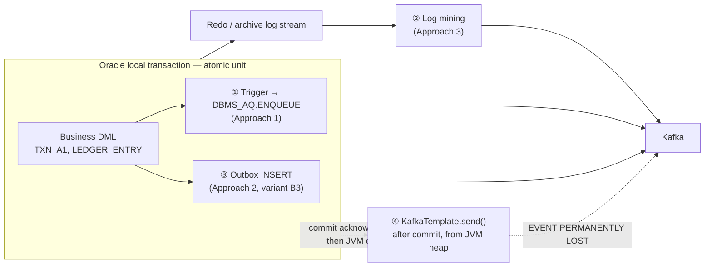
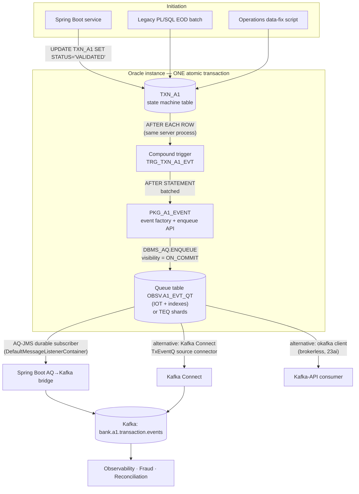
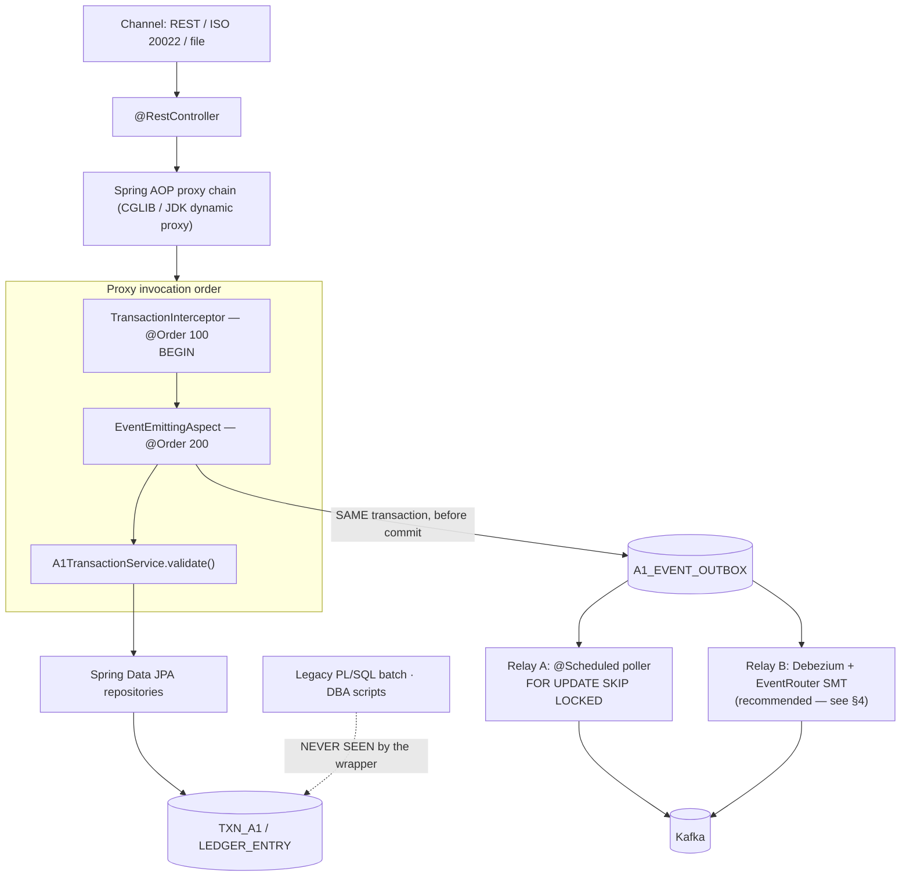
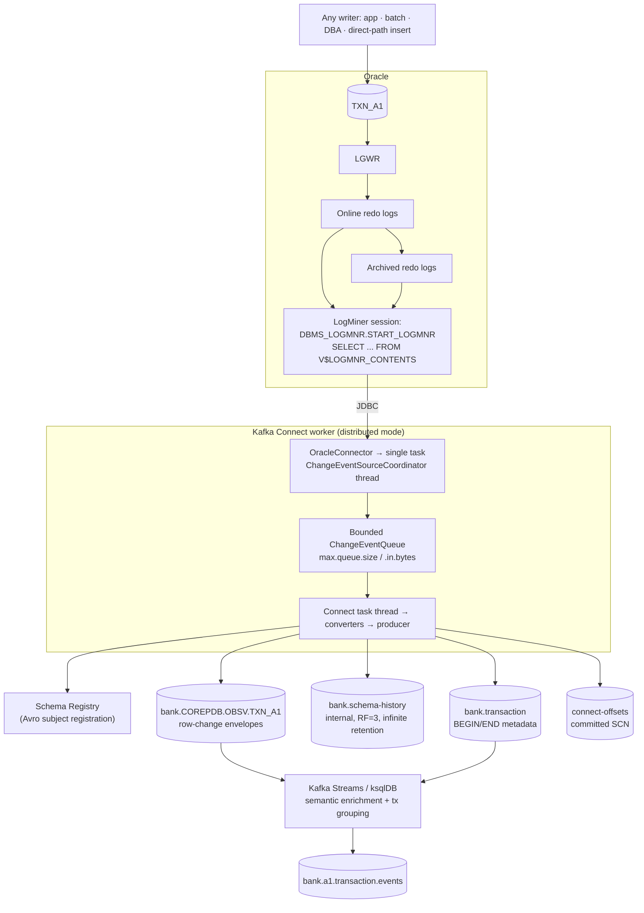
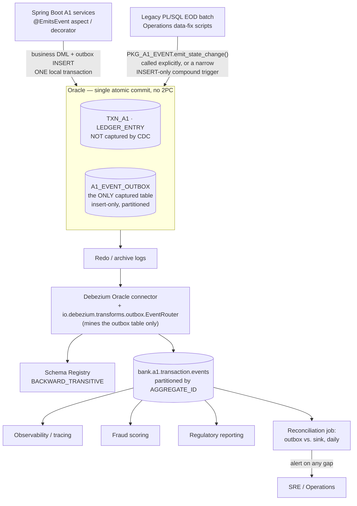
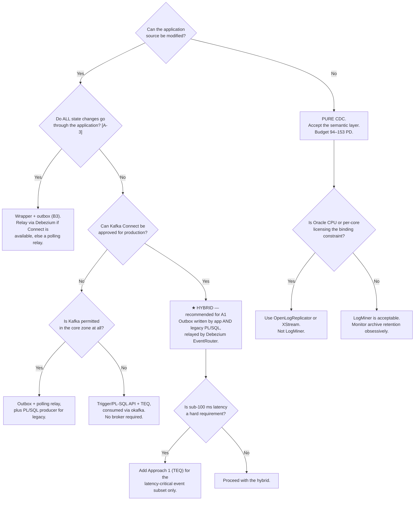

# Event-Based Observability of Transaction Processing in Bank Operations
## A Rigorous Comparative Analysis of Three Event-Generation Patterns for Oracle-Backed Core Banking

> **Reference workflow throughout this document:** the A1 transaction state machine
> `INITIATED → VALIDATED → PROCESSED` (with terminal branch `REJECTED`), each transition being a
> committed state change in Oracle that must yield exactly one durable, ordered, semantically-typed
> business event on the enterprise event bus.
>
> **Reference stack:** Oracle Database 19c/23ai (RAC + Data Guard), Spring Boot 4.1.1 on Java 21,
> `ojdbc17`, Apache Kafka 3.x + Kafka Connect + Confluent Schema Registry, Micrometer/Prometheus.

---

## 0. Scope, Assumptions and Reading Guide

### 0.1 Stated assumptions

Every architectural recommendation is conditional. These are the conditions; each is referenced as **[A-n]** where it drives a conclusion, so a reader can invalidate a recommendation by invalidating its premise.

| # | Assumption | Consequence if false |
|---|---|---|
| **A-1** | *A1* denotes the highest-criticality transaction class — customer-visible funds movement (instant payment, card authorisation, internal transfer) — with availability ≥ 99.95 % and a regulatory duty to reconstruct every state transition. | If A1 is lower-criticality, the reliability weighting in §3.6 falls and the cheapest pattern becomes admissible. |
| **A-2** | Oracle is the **system of record**. A transaction is real iff its local Oracle transaction commits. No XA/2PC spans Oracle and the broker. | With genuine XA across resource managers, §1.x.2's transaction-boundary analysis must be extended (see §4.6). |
| **A-3** | **Not all DML on the core tables originates from the Spring application.** Legacy PL/SQL batch, EOD processing, operations data-fix scripts and vendor modules also mutate state. | If every write goes through Java, Approach 2 loses its decisive weakness and wins outright (§3.6 sensitivity). |
| **A-4** | Oracle 19c+, `ARCHIVELOG` mode, `FORCE LOGGING`, RAC ≥ 2 nodes, Data Guard physical standby. | Without ARCHIVELOG, Approach 3 is impossible. Without FORCE LOGGING, Approach 3 silently loses `NOLOGGING` operations. |
| **A-5** | Kafka is the event backbone. Consumers are observability, fraud, reconciliation and analytics systems — **not** participants in the banking transaction. | If a consumer is a transactional participant, at-least-once + idempotency is insufficient and a Saga with compensations is required. |
| **A-6** | Application and database organisations are separate, with separate change-control boards and change windows. | If one team owns both, LOE and maintenance figures in §3 fall by ~20–30 %. |

### 0.2 The two orthogonal axes of the comparison

The entire analysis reduces to two independent questions. Keeping them separate is what prevents the usual muddled "CDC vs. triggers" debate.

**Axis 1 — Atomicity: where is the event created relative to the transaction boundary?**



Positions ①, ② and ③ are safe: each is atomic with the business transaction, either by joining it (①, ③) or by being derived from the durable artefact the commit itself produced (②). Position ④ — the naive form of Approach 2 — is the **dual-write anti-pattern** and loses events by construction.

**Axis 2 — Semantics: how much business meaning does the raw output carry?**

| | Approach 1 (Trigger/AQ) | Approach 2 (Wrapper) | Approach 3 (CDC) |
|---|---|---|---|
| Raw output | Row change, enrichable in PL/SQL | Named business event | Row change (physical) |
| Business intent | Partial — only what the row shows | **Complete** — method, arguments, principal, channel, trace id | **None** — must be reconstructed downstream |
| Multi-table transaction grouping | Manual (compound trigger, statement level) | Natural (one use case = one event) | Requires transaction-metadata topic + stream join |
| Semantic drift risk | Moderate | **None** (event authored with the logic) | **High** (mapping lives in a second codebase) |

CDC captures meaningless facts perfectly. The wrapper captures meaningful facts incompletely. Bridging that gap is the actual design problem, and §4 shows the two axes are *composable* rather than rival.

### 0.3 Delivery semantics — stated once, applies throughout

**None of the three patterns provides end-to-end exactly-once delivery.** All three provide **at-least-once** delivery to the bus. Exactly-once *effect* is obtained by making consumers idempotent on a stable `EVENT_ID`. Approach 2 in its naive form (position ④) degrades to **at-most-once**, which is precisely why it is inadmissible for A1. The thesis should state this once, formally, because the literature routinely conflates "Kafka exactly-once" (a producer↔broker property, `enable.idempotence` + transactional producer) with end-to-end exactly-once (an application-level property that requires idempotent consumers).

---

# 1. DETAILED ARCHITECTURAL BREAKDOWN

---

## 1.1 Approach 1 — Internal Oracle PL/SQL (Triggers, Advanced Queuing, PL/SQL Packages)

### 1.1.1 System Architecture Description



**Data flow, step by step, for the `VALIDATED` transition:**

1. Any writer issues `UPDATE TXN_A1 SET STATUS='VALIDATED', ... WHERE TXN_ID=:1`. A transaction is implicitly open; undo is allocated, row locks (`TX` enqueue) taken.
2. Oracle fires the row-level section of the compound trigger **synchronously, inside the same server process, inside the same call**, once per affected row. The trigger has `:OLD` and `:NEW` correlation pseudo-records and reads them without any additional I/O.
3. The trigger *lifts* the physical change to a business event type by inspecting `:OLD.STATUS → :NEW.STATUS`. Events are accumulated into a PL/SQL collection rather than enqueued immediately — this converts N row-level enqueues into one batched statement-level pass and avoids the mutating-table restriction (`ORA-04091`) if enrichment queries are needed.
4. The `AFTER STATEMENT` section calls `PKG_A1_EVENT.enqueue`, which constructs the payload (`JSON_OBJECT ... RETURNING CLOB`) and calls `DBMS_AQ.ENQUEUE` with `enqueue_options.visibility := DBMS_AQ.ON_COMMIT`.
5. The enqueue is ordinary DML against the queue table. It generates redo and undo and is **part of the same transaction**. If the business transaction rolls back, the message is rolled back with it. This is the atomicity guarantee, and it is free — no protocol, no coordinator.
6. On `COMMIT`, the message becomes visible to subscribers. `LGWR` writes the redo (business row + queue row) in one write; `log file sync` is paid once.
7. The egress tier dequeues. With AQ-JMS, a `DefaultMessageListenerContainer` thread calls `DBMS_AQ.DEQUEUE` in a transacted JMS session, publishes to Kafka, waits for `acks=all`, then commits the JMS session — which deletes/marks the queue row. Failure anywhere before that commit causes redelivery.

### 1.1.2 Technical Mechanics

**Execution context.** The trigger body executes in the **PL/SQL virtual machine inside the user's Oracle server process** (dedicated server, or a shared-server process from the pool). It is not a separate thread, not a separate session, and not asynchronous. Its CPU, PGA, latch acquisitions and redo generation are all charged to the calling session and are all on the OLTP critical path. Recursive SQL issued by the trigger runs at a deeper recursion level within the same call stack. Practical implication: **every microsecond spent in the trigger is added directly to the business transaction's response time**, and it is spent on Oracle-licensed CPU.

**Thread management.**
* *Enqueue side:* no threading at all. Strictly synchronous, serial within the statement.
* *AQ infrastructure:* the `QMNC` coordinator spawns `Qnnn` slaves (formerly governed by `AQ_TM_PROCESSES`, now auto-tuned) for time management — expiry, delay, retry scheduling and inter-database propagation. These are background processes with their own sessions; their cost is proportional to queue depth and to the number of queues, not to the transaction rate directly.
* *Dequeue side:* Spring's `DefaultMessageListenerContainer` runs a pool of `concurrency` threads, each holding its own JMS session backed by its own JDBC connection and therefore its own Oracle session. Each thread performs a blocking `DBMS_AQ.DEQUEUE` with `wait => DBMS_AQ.FOREVER` (or a bounded wait), which parks the Oracle session on the `Streams AQ: waiting for messages in the queue` wait event. **Sizing note:** *N* listener threads permanently occupy *N* Oracle sessions and *N* processes — on a database with a tight `PROCESSES` limit this is a real capacity consideration, and it is the reason a separate connection pool should be used for the bridge rather than sharing the OLTP pool.
* *Ordering:* concurrency > 1 destroys global FIFO. If per-key ordering matters (it does for A1), either use `concurrency=1` with batching, or use TEQ sticky dequeue with per-shard affinity, or accept unordered dequeue and restore order downstream via the `EVENT_SEQ` field and Kafka partitioning by `aggregate_id`.

**Transaction boundaries.** Pure **local transaction**. There is exactly one resource manager (Oracle), so no 2PC and no Saga is needed for the *capture* half. The enqueue joins the business transaction by virtue of being DML in the same session. This is the single most important structural property of Approach 1 and it is what distinguishes it from any application-side messaging.

The *egress* half is a separate, second transaction and is where the unavoidable handover occurs:

* **Dequeue (Oracle tx) + Kafka publish** cannot be made atomic without XA, and Kafka's transaction protocol is not an XA resource manager. Attempting `JtaTransactionManager` across AQ and Kafka is a category error worth naming explicitly in the thesis.
* Therefore the bridge deliberately implements **at-least-once with a duplicate window**: publish to Kafka → wait for `acks=all` → commit the JMS session. A crash between the Kafka ack and the JMS commit redelivers the message, producing a duplicate — never a loss. The asymmetry (duplicates possible, loss impossible) is exactly what an A1 workflow requires, given idempotent consumers keyed on `EVENT_ID`.

**Persistence-layer coupling.** Maximal. The event schema, the state→event mapping, and the publication mechanism all live inside the database schema and are versioned, deployed and secured as database objects. The application layer has zero knowledge of the observability pipeline — which is simultaneously the pattern's greatest operational virtue (it cannot be bypassed) and its greatest engineering liability (it cannot be unit-tested, reviewed or released with the application's toolchain).

**Edge case worth naming:** triggers are **not fired** by direct-path operations — `INSERT /*+ APPEND */`, `INSERT /*+ APPEND_VALUES */`, SQL*Loader direct path, `ALTER TABLE ... EXCHANGE PARTITION`, and most `CREATE TABLE AS SELECT` reload patterns. EOD batch processing in banks uses precisely these techniques for performance. **Approach 1 therefore has a genuine, silent capture gap on exactly the workload where volumes are highest.**

### 1.1.3 Failure Modes & Edge Cases

| Scenario | Mechanics | Outcome | Event loss |
|---|---|---|---|
| **Business transaction rollback** | Queue-table DML is rolled back with everything else | No message ever becomes visible | None (correct) |
| **Unhandled exception in the trigger** (e.g. `ORA-01438 value larger than specified precision`, `ORA-06502`, JSON build failure) | The exception propagates to the DML statement, which fails, which fails the business transaction | **The payment fails.** The observability layer has caused a core-banking outage | None — but an **availability incident**. This is Approach 1's defining risk. |
| **Instance crash (single node)** | Committed = in redo; instance recovery replays | Queue table recovered; messages intact | None |
| **RAC node failure** | Queue-table blocks remastered to a surviving instance; classic AQ shows `gc buffer busy acquire` / `enq: TX` spikes on the queue-table time-manager index during remastering. TEQ fails the shard over cleanly | Brief latency spike, then normal | None |
| **Data Guard failover** | The queue table is an ordinary segment in the database; it fails over with the database. Durable subscribers and their dequeue positions are stored in the queue table itself | Messages survive; bridge reconnects via FAN/FCF to the new primary | None |
| **Network partition — bridge loses Kafka** | `kafka.send().get()` throws after `delivery.timeout.ms`; JMS session rolls back; `retry_count` increments; AQ reschedules with `retry_delay` | Message redelivered; queue depth grows | None |
| **Network partition — bridge loses Oracle** | Listener container's connection recovery loop; FAN ONS notification triggers fast reconnect | Bridge stalls, queue grows | None |
| **Backpressure: dequeue slower than enqueue** | The queue table grows monotonically. **AQ applies no backpressure to producers.** There is no flow control back to the OLTP path | Tablespace fills → `ORA-01653 unable to extend` → **raised inside the business transaction's enqueue** → payments fail | None, but a **delayed availability incident**. This is the most dangerous operational failure of Approach 1: an unnoticed consumer outage becomes a core banking outage hours later. |
| **`max_retries` exhausted** | Message moved to the exception queue `AQ$_A1_EVT_QT_E`, invisible to normal subscribers | Silently absent from the stream | **YES**, unless the exception queue is explicitly monitored and alerted |
| **Poison message** (payload consumers cannot parse) | Repeated redelivery until `max_retries`, consuming bridge throughput | Head-of-line blocking with `concurrency=1` | Eventual loss to exception queue |
| **Direct-path insert / partition exchange** | Trigger does not fire | Changes invisible to the pipeline | **YES — silent** |
| **`TRUNCATE`, `DROP PARTITION`** | DDL; no DML trigger fires | Invisible | **YES — silent** |
| **Queue table maintenance** (`PURGE_QUEUE_TABLE`, coalescing) | Requires a maintenance window; long-running purge holds locks | Bridge latency spike | None |

---

## 1.2 Approach 2 — Application-Level Wrapper (Spring Boot Middleware, AOP, Decorator)

### 1.2.1 System Architecture Description

Three variants are habitually conflated under "the wrapper approach". They differ by **orders of magnitude in reliability** and must be separated:

| Variant | Mechanism | Delivery semantics | Admissible for A1? |
|---|---|---|---|
| **B1** | `@AfterReturning` → `kafkaTemplate.send()` directly | **At-most-once**; also emits **phantom events** for transactions that subsequently roll back | **No** |
| **B2** | `@TransactionalEventListener(phase = AFTER_COMMIT)` → `kafkaTemplate.send()` | **At-most-once** (no phantoms, but an unprotected commit↔ack window) | **No** |
| **B3** | AOP/decorator → **transactional outbox** row in the same JPA transaction → relay | **At-least-once, zero structural loss** | **Yes** |

B1 and B2 are retained in this thesis as the *refuted baselines*: measuring their loss rate under fault injection (§A.3, cases F1–F2) is the empirical result that motivates everything else.



**Data flow for the `VALIDATED` transition:**

1. Request arrives on a Tomcat worker thread (or a virtual thread if `spring.threads.virtual.enabled=true` — Java 21 makes this viable and it is worth benchmarking as a thesis sub-experiment).
2. The AOP proxy chain is entered. `TransactionInterceptor` opens a JPA/JDBC transaction and binds the `EntityManager` and the `Connection` to the thread via `TransactionSynchronizationManager` (a `ThreadLocal`).
3. `EventEmittingAspect` — ordered *inside* the transaction interceptor — proceeds to the target method.
4. Business logic mutates the aggregate; JPA's dirty-checking defers the `UPDATE` to flush time.
5. On return, the aspect evaluates SpEL against the method arguments and return value, serialises the payload with Jackson **on the application thread**, and inserts one row into `A1_EVENT_OUTBOX` **through the same bound `Connection`** — hence the same transaction.
6. Commit. Business row and outbox row become durable together, in a single redo write.
7. The relay publishes to Kafka and marks or deletes the outbox row.

### 1.2.2 Technical Mechanics

**Execution context.** Everything except the two `INSERT`/`UPDATE` statements runs in the JVM. Payload serialisation, schema-version stamping, PII masking and trace correlation are all application-tier CPU. **In a bank running Oracle Enterprise Edition with per-core licensing, this is a direct, quantifiable cost advantage that should appear in the thesis's economic analysis:** the same work costs materially more when executed inside the database.

**Thread management.**
* *Capture:* the request thread. No additional threads, no handoff, no queue. Under Java 21 virtual threads, the outbox insert is a blocking JDBC call that parks the virtual thread and releases the carrier — a genuine scalability benefit, provided the driver does not pin (`ojdbc17` is `ReentrantLock`-based and does not pin, unlike older synchronized-heavy drivers; verify and cite).
* *Relay (poller):* `ThreadPoolTaskScheduler`, typically one thread per instance. `FOR UPDATE SKIP LOCKED` lets *N* application instances relay concurrently without coordination and without duplicating work — this is what makes the relay horizontally scalable and highly available. Note the trade-off: concurrent relays **do not preserve global ordering**; per-key ordering is restored by partitioning Kafka on `AGGREGATE_ID` and by consumers using `EVENT_SEQ` for gap detection and re-ordering.
* *Kafka producer:* `KafkaTemplate` is thread-safe and owns a background `Sender` I/O thread plus an accumulator buffer (`buffer.memory`). `send()` is asynchronous; `.join()`/`.get()` blocks the caller until the broker acknowledges. **The blocking call must be outside the business transaction and inside the relay transaction** — a `send().get()` inside a `@Transactional` business method holds a database transaction open across a network round trip, converting broker latency into row-lock duration and, under broker degradation, into a database-wide lock storm. This is a frequently-shipped production defect and deserves an explicit paragraph.

**Transaction boundaries.** Local Oracle transaction, single resource manager, no 2PC. The correctness of B3 rests entirely on one non-obvious configuration detail:

> Spring's transaction advisor is registered at `Ordered.LOWEST_PRECEDENCE` by default. An aspect at default order is therefore *ambiguously ordered* relative to it and may execute **outside** the transaction — silently degrading B3 back to B2. The fix is to lower the transaction advisor explicitly, `@EnableTransactionManagement(order = 100)`, and order the aspect at `200`. The difference between a zero-loss and a lossy architecture is this single integer, and it is invisible in code review unless you know to look.

Defence in depth: assert `TransactionSynchronizationManager.isActualTransactionActive()` at runtime and declare the outbox writer `@Transactional(propagation = Propagation.MANDATORY)`, so a mis-ordered aspect fails loudly in CI instead of silently in production.

**On 2PC, Saga and local transactions.** For a *single-service* A1 workflow, local transactions plus the outbox are sufficient and strictly preferable to 2PC — XA across Oracle and Kafka is neither supported in practice nor desirable (blocking coordinator, in-doubt transactions holding row locks through a coordinator outage — a catastrophic failure mode in core banking). For a *multi-service* A1 workflow (`INITIATED` in the payment service, `VALIDATED` in a sanctions-screening service, `PROCESSED` in the ledger service), the correct pattern is a **Saga**, where each local step commits its own state and its own outbox event atomically, and compensating transactions handle rollback. **The outbox is the mechanism that makes a Saga reliable**; it is not an alternative to it. This relationship is worth an explicit subsection in the thesis, since it is commonly presented as a choice.

**Persistence-layer coupling.** Loose. The outbox table is an application-owned artefact with no foreign keys to the core schema, no triggers and no constraints beyond a unique `EVENT_ID`. It can be migrated with Flyway/Liquibase on the application's release train. Event schemas live in the Schema Registry and are compatibility-checked in CI.

### 1.2.3 Failure Modes & Edge Cases

| Scenario | B1 (naive) | B2 (after-commit) | B3 (outbox) |
|---|---|---|---|
| Business tx rolls back after publish | **Phantom event** — an event describing a transaction that never happened. *In a bank this is worse than a lost event:* a fraud engine or a customer notification acts on a payment that does not exist | Prevented | Prevented |
| `SIGKILL` between commit and broker ack | **Lost** | **Lost** | Survives — the row is in the outbox |
| Kafka unavailable 10 min | **Lost** (or, if synchronous, blocks the business transaction and takes down payments) | **Lost** | Backlog accumulates in the outbox; nothing is lost |
| Application instance dies mid-relay | n/a | n/a | Another instance claims the rows via `SKIP LOCKED` |
| Database failover (RAC/DG) | Business tx fails and retries | Same | Same; outbox rows survive with the database |
| Backpressure | Producer buffer fills → `send()` blocks for `max.block.ms` → **request threads exhausted → the payment API stops serving** | Same | **Bounded and safe:** the relay falls behind, the outbox grows, the OLTP path is entirely unaffected. Backpressure is absorbed by cheap table storage. |
| Outbox purge job disabled | n/a | n/a | Unbounded growth → tablespace pressure. Mitigate with interval partitioning + `DROP PARTITION`, never `DELETE` |
| **Writes bypassing the application [A-3]** | **Invisible** | **Invisible** | **Invisible** — the structural weakness of the entire approach |
| **Self-invocation / `private` / `final` method** | **Silently no event** | **Silently no event** | **Silently no event** — AOP failures are silent by nature. Mitigate with an ArchUnit rule asserting every `@EmitsEvent` method is `public`, non-`final`, and only invoked across bean boundaries |
| Developer forgets the annotation on a new state transition | Missing event | Missing event | Missing event — mitigate with a reconciliation job (§A.2) that compares state transitions against emitted events and alerts on any gap |

The two structural gaps — **bypass [A-3]** and **silent non-application** — cannot be engineered away within Approach 2. They can only be detected (by reconciliation) or eliminated (by composition with another approach, §4).

---

## 1.3 Approach 3 — Change Data Capture (Oracle Redo Logs, Debezium, Kafka Connect, Schema Registry)

### 1.3.1 System Architecture Description



**Ingestion adapter — a decisive sub-choice that is often skipped:**

| Adapter | Mechanism | Licence | In-database cost | Maturity |
|---|---|---|---|---|
| **LogMiner** (default) | Debezium calls `DBMS_LOGMNR` and polls `V$LOGMNR_CONTENTS` over JDBC | Included with EE/SE | **High** — mining runs *inside* the database, consuming licensed CPU and PGA | Production; the most widely deployed |
| **XStream** | Debezium is an XStream outbound-server client | **Requires an Oracle GoldenGate licence** (substantial) | Low — purpose-built native capture | Production; best performance |
| **OpenLogReplicator** | External C++ process parses redo files directly; Debezium connects over its protocol | Open source, no Oracle licence | **Near zero** — no database session at all | Introduced in Debezium 2.4 as experimental; matured since |

This choice is the difference between "CDC is unaffordable on our core database" and "CDC is essentially free", and it is a strong, self-contained section for the thesis.

**Data flow for the `VALIDATED` transition:**

1. `UPDATE TXN_A1 ...` generates a redo change vector. With supplemental logging enabled, the before-image of the logged columns is written alongside.
2. `COMMIT` forces `LGWR` to write, including the commit redo record carrying the commit SCN.
3. Debezium's `LogMinerStreamingChangeEventSource` runs a loop: determine an SCN range, add the relevant online/archived logs, `START_LOGMNR`, query `V$LOGMNR_CONTENTS` for the range, then sleep for an adaptively-tuned interval.
4. Rows for an in-flight transaction are **buffered per `txId`** and are emitted **only when the corresponding `COMMIT` record is seen**. Consequently Debezium never publishes uncommitted data — read-committed semantics are preserved across the pipeline. This is the property that makes CDC safe despite operating entirely outside the transaction.
5. Emitted `SourceRecord`s go into a bounded in-memory `ChangeEventQueue`. The Connect task thread drains it, applies converters (Avro + Schema Registry) and SMTs, and produces to Kafka.
6. Offsets — `{scn, commit_scn, txId, ...}` — are committed to `connect-offsets` periodically (`offset.flush.interval.ms`). On restart, streaming resumes from the last committed SCN, which is the source of duplicates.

### 1.3.2 Technical Mechanics

**Execution context.** Entirely **out of process** with respect to the application, and — with LogMiner — partially *in* process with respect to the database: the mining work runs inside an Oracle session created by the connector. This is the crucial nuance that "CDC has no impact on the database" glosses over. The impact is not on the *transaction path*, but it is very much on the *server*.

**Thread management.**
* One connector → **`tasks.max` is effectively 1** for Oracle. The redo stream is a single ordered log; it cannot be sharded across tasks. Adding Connect workers gives **failover, not parallelism** — a capacity-planning fact worth stating plainly, since it means CDC throughput for a given Oracle database has a hard ceiling set by one JVM's mining and conversion rate.
* Inside the task: a `ChangeEventSourceCoordinator` thread (snapshot, then streaming), the Connect task thread (drain → convert → produce), and the Kafka producer's `Sender` thread.
* The bounded `ChangeEventQueue` is the **backpressure mechanism**: when Kafka slows, the queue fills, and the streaming source blocks — mining pauses, the committed SCN stops advancing, and archive logs accumulate. Backpressure is therefore transmitted from Kafka all the way back into the archive-log retention budget, which is why §1.3.3's archive-purge scenario is the pattern's most dangerous failure.

**Transaction boundaries.** Debezium is **not a participant in any transaction**. It has no session in the business transaction, takes no locks, and cannot roll anything back. Consistency is inherited from the redo log — the durable artefact the commit itself produced — which is why the pattern is safe despite the lack of participation. Its own state (offsets, schema history) is maintained in Kafka topics with their own at-least-once semantics; **the connector's offset commit and its record production are not atomic with each other**, which is precisely the origin of duplicate delivery on restart.

Explicitly: no 2PC, no Saga, no local transaction enlistment. For multi-table A1 transactions, `provide.transaction.metadata=true` emits `BEGIN`/`END` markers on a `bank.transaction` topic and stamps each change event with `transaction.id`, `transaction.total_order` and `transaction.data_collection_order`. Reconstructing "one A1 business transaction touched one `TXN_A1` row and two `LEDGER_ENTRY` rows" requires a stateful, windowed stream join keyed on `transaction.id`, buffering until the `END` marker's per-collection counts are satisfied, with a timeout policy for markers that never arrive. **This is real, non-trivial stream-processing engineering and constitutes a large share of Approach 3's true LOE — the share that naive estimates omit.**

**Persistence-layer coupling.** Paradoxically the **tightest** of the three, despite requiring no code changes. The Debezium topic schema is a mechanical projection of the table's DDL. The moment a downstream consumer depends on it, the *physical database schema becomes a published public contract*: adding a column is additive and safe, but renaming one, changing its type, or splitting the table becomes a breaking change for systems the DBA has never heard of. In a bank, where core schemas evolve slowly but do evolve, this coupling is a long-term governance liability and belongs in the trade-off analysis.

**Schema Registry mechanics.** With `AvroConverter`, each topic registers subjects (`<topic>-key`, `<topic>-value` under the default `TopicNameStrategy`). Set `BACKWARD_TRANSITIVE` compatibility so that a new consumer can read the entire history — the relevant guarantee for regulatory replay. For the enriched business-event topic, prefer `TopicRecordNameStrategy` so that several event types can coexist on one topic while remaining independently versioned.

### 1.3.3 Failure Modes & Edge Cases

| Scenario | Mechanics | Outcome | Event loss |
|---|---|---|---|
| Connect worker crash | Rebalance; task restarts on another worker from the last committed offset | Recovers | None; **duplicates** for records produced after the last offset flush |
| Kafka unavailable | Producer retries; `ChangeEventQueue` fills; mining stalls | Lag grows | None, if within archive retention |
| **Connect outage longer than archive-log retention** | RMAN deletes archive logs the connector still needs → `ORA-01291: missing logfile` | Connector cannot proceed; requires a **re-snapshot** | **YES — permanent and unrecoverable for that window. The single most severe failure mode in this document.** |
| **Transaction open longer than `log.mining.transaction.retention.ms`** | Debezium discards the buffered transaction to bound memory | Its changes are never emitted | **YES — completely silent.** Bank EOD batches routinely exceed default retention. |
| **Idle period without heartbeats** | No changes on captured tables → committed offset does not advance → on restart, hours of logs must be mined, or have been purged | Precondition for the two failures above | Indirect, but this is the **most common root cause of Debezium data loss in production** |
| `NOLOGGING` / `UNRECOVERABLE` operation | Change vectors are not in redo | Nothing to mine | **YES** — mitigated by `ALTER DATABASE FORCE LOGGING` [A-4], which Data Guard mandates anyway |
| Direct-path insert `/*+ APPEND */` | Still generates redo | **Captured correctly** | None — a decisive advantage over Approach 1 |
| DDL on a captured table while the connector is stopped, with `log.mining.strategy=online_catalog` | The dictionary no longer matches the historical redo | Unparseable rows; connector fails or mis-maps columns | Possible; `redo_log_catalog` avoids it at the cost of substantial extra redo from `DBMS_LOGMNR_D.BUILD` |
| **RAC with an unreachable redo thread** | Each instance writes its own thread; all must be mined | Changes from that instance are missing | **YES** — configure `rac.nodes` and ensure every thread's logs are reachable |
| Data Guard switchover | SCN continuity is preserved (same redo stream); the connector must reconnect via a role-following service | Recovers | None, with correct service configuration |
| Data Guard **failover with flashback/reinstate** | The database's SCN may move backwards relative to the connector's stored offset | Offset is ahead of the database | Possible loss **and** duplicates; requires an explicit runbook |
| Snapshot of a large table | `snapshot.mode=initial` with `snapshot.locking.mode=none` uses flashback-consistent reads; long snapshots hold undo | `ORA-01555 snapshot too old`; snapshot restarts from the beginning | None, but potentially hours of wasted work — prefer incremental snapshots via the signalling table |
| LOB / `LONG` / `XMLTYPE` columns | Historically restricted; `lob.enabled` carries caveats | Partial or absent column data | Partial |
| **Semantic drift** — a new `STATUS` value added without updating the enrichment topology | The mapping's `default` branch drops it | The new business event silently never appears | **YES — and invisible to any technical monitoring.** The characteristic weakness of Approach 3, and the one with no configuration fix. |

---

# 2. PROOF OF CONCEPT — CODE & CONFIGURATION

All snippets target the A1 transition sequence `INITIATED → VALIDATED → PROCESSED`, and are written to production standards (explicit error handling, idempotency keys, trace propagation, monitoring hooks) rather than as minimal illustrations.

---

## 2.1 Approach 1 — Oracle Internal (DDL, AQ, Trigger, `DBMS_AQ`)

### 2.1.1 DDL — A1 transaction state table

```sql
CREATE TABLE OBSV.TXN_A1 (
  TXN_ID          NUMBER(19)    GENERATED ALWAYS AS IDENTITY PRIMARY KEY,
  TXN_REF         VARCHAR2(64)  NOT NULL,
  DEBIT_IBAN      VARCHAR2(34)  NOT NULL,
  CREDIT_IBAN     VARCHAR2(34)  NOT NULL,
  AMOUNT          NUMBER(19,4)  NOT NULL,
  CURRENCY        CHAR(3)       NOT NULL,
  STATUS          VARCHAR2(16)  NOT NULL,
  CHANNEL         VARCHAR2(24),
  VALUE_DATE      DATE,
  REJECT_CODE     VARCHAR2(16),
  CREATED_AT      TIMESTAMP(6)  DEFAULT SYSTIMESTAMP NOT NULL,
  UPDATED_AT      TIMESTAMP(6)  DEFAULT SYSTIMESTAMP NOT NULL,
  VERSION         NUMBER(10)    DEFAULT 0 NOT NULL,      -- JPA optimistic locking
  CONSTRAINT UQ_TXN_A1_REF   UNIQUE (TXN_REF),
  CONSTRAINT CK_TXN_A1_STATE CHECK (STATUS IN ('INITIATED','VALIDATED','PROCESSED','REJECTED'))
);

CREATE INDEX OBSV.IX_TXN_A1_STATUS_TS ON OBSV.TXN_A1 (STATUS, UPDATED_AT);

-- Per-aggregate monotonic event counter. Enables downstream gap detection (§A.2)
-- and is shared by all three approaches so the comparison is apples-to-apples.
CREATE TABLE OBSV.TXN_A1_EVT_SEQ (
  TXN_ID   NUMBER(19) PRIMARY KEY,
  LAST_SEQ NUMBER(10) DEFAULT 0 NOT NULL
);
```

### 2.1.2 DDL — AQ queue table and queue

```sql
-- Classic AQ: portable from 11g to 26ai, JMS-interoperable payload.
BEGIN
  DBMS_AQADM.CREATE_QUEUE_TABLE(
    queue_table        => 'OBSV.A1_EVT_QT',
    queue_payload_type => 'SYS.AQ$_JMS_TEXT_MESSAGE',
    multiple_consumers => TRUE,          -- publish/subscribe: several independent subscribers
    sort_list          => 'ENQ_TIME',    -- FIFO by enqueue time
    storage_clause     => 'TABLESPACE OBSV_QUEUE_TBS',   -- isolate from core tablespaces
    compatible         => '10.0');

  DBMS_AQADM.CREATE_QUEUE(
    queue_name  => 'OBSV.A1_EVT_Q',
    queue_table => 'OBSV.A1_EVT_QT',
    max_retries => 5,
    retry_delay => 2);                   -- seconds; exponential backoff is not native to AQ

  DBMS_AQADM.START_QUEUE(queue_name => 'OBSV.A1_EVT_Q');

  DBMS_AQADM.ADD_SUBSCRIBER(
    queue_name => 'OBSV.A1_EVT_Q',
    subscriber => SYS.AQ$_AGENT('OBSERVABILITY_BRIDGE', NULL, NULL),
    rule       => NULL);                 -- content-based routing possible here
END;
/
```

```sql
-- Transactional Event Queue (21c+/23ai): sharded, RAC-friendly, Kafka-API addressable.
-- Preferred over classic AQ wherever the release permits it.
BEGIN
  DBMS_AQADM.CREATE_TRANSACTIONAL_EVENT_QUEUE(
    queue_name         => 'OBSV.A1_TXN_EVENTS',
    queue_payload_type => DBMS_AQADM.JMS_TYPE,     -- JSON_TYPE also available on 23ai
    multiple_consumers => TRUE);

  DBMS_AQADM.SET_QUEUE_PARAMETER('OBSV.A1_TXN_EVENTS', 'SHARD_NUM', 8);
  DBMS_AQADM.SET_QUEUE_PARAMETER('OBSV.A1_TXN_EVENTS', 'STICKY_DEQUEUE', 1);
  DBMS_AQADM.SET_QUEUE_PARAMETER('OBSV.A1_TXN_EVENTS', 'KEY_BASED_ENQUEUE', 1);
  DBMS_AQADM.START_QUEUE('OBSV.A1_TXN_EVENTS');
END;
/
```

> **Version caveat for the thesis.** `DBMS_AQADM` signatures and available queue parameters differ across 19c / 21c / 23ai / 26ai. On 23ai a TEQ can be created directly as a Kafka topic (`DBMS_AQADM.CREATE_DATABASE_KAFKA_TOPIC`) and consumed by unmodified Kafka clients through `okafka`, eliminating the broker entirely. Always cite the release-specific *Oracle Database Advanced Queuing User's Guide* edition you tested against.

### 2.1.3 PL/SQL package — event factory and publication API

```sql
CREATE OR REPLACE PACKAGE OBSV.PKG_A1_EVENT AS
  SCHEMA_VERSION CONSTANT VARCHAR2(8) := '1.0.0';

  FUNCTION next_seq(p_txn_id IN NUMBER) RETURN NUMBER;

  PROCEDURE publish(p_event_type   IN VARCHAR2,
                    p_aggregate_id IN VARCHAR2,
                    p_event_seq    IN NUMBER,
                    p_payload      IN CLOB);

  -- Called directly by legacy PL/SQL batches so that non-application writers are covered [A-3]
  PROCEDURE emit_state_change(p_txn_id     IN NUMBER,
                              p_old_status IN VARCHAR2,
                              p_new_status IN VARCHAR2,
                              p_source     IN VARCHAR2 DEFAULT 'PLSQL');
END PKG_A1_EVENT;
/

CREATE OR REPLACE PACKAGE BODY OBSV.PKG_A1_EVENT AS

  FUNCTION event_type_for(p_old IN VARCHAR2, p_new IN VARCHAR2) RETURN VARCHAR2 IS
  BEGIN
    RETURN CASE
             WHEN p_old IS NULL              THEN 'A1TransactionInitiated'
             WHEN p_new = 'VALIDATED'        THEN 'A1TransactionValidated'
             WHEN p_new = 'PROCESSED'        THEN 'A1TransactionProcessed'
             WHEN p_new = 'REJECTED'         THEN 'A1TransactionRejected'
             ELSE NULL
           END;
  END event_type_for;

  FUNCTION next_seq(p_txn_id IN NUMBER) RETURN NUMBER IS
    l_seq NUMBER;
  BEGIN
    -- Serialises per aggregate only. Because an A1 transaction is short-lived and touched by
    -- one session at a time, this is not a contention point. Keying by ACCOUNT instead of
    -- TXN_ID would make it a severe hot-block problem on high-turnover accounts.
    MERGE INTO OBSV.TXN_A1_EVT_SEQ t
    USING (SELECT p_txn_id AS txn_id FROM dual) s ON (t.txn_id = s.txn_id)
     WHEN MATCHED     THEN UPDATE SET t.last_seq = t.last_seq + 1
     WHEN NOT MATCHED THEN INSERT (txn_id, last_seq) VALUES (p_txn_id, 1);

    SELECT last_seq INTO l_seq FROM OBSV.TXN_A1_EVT_SEQ WHERE txn_id = p_txn_id;
    RETURN l_seq;
  END next_seq;

  PROCEDURE publish(p_event_type   IN VARCHAR2,
                    p_aggregate_id IN VARCHAR2,
                    p_event_seq    IN NUMBER,
                    p_payload      IN CLOB) IS
    l_enq_opt  DBMS_AQ.ENQUEUE_OPTIONS_T;
    l_msg_prop DBMS_AQ.MESSAGE_PROPERTIES_T;
    l_msg_id   RAW(16);
    l_msg      SYS.AQ$_JMS_TEXT_MESSAGE;
  BEGIN
    l_msg := SYS.AQ$_JMS_TEXT_MESSAGE.construct;
    l_msg.set_text(p_payload);
    l_msg.set_string_property('eventType',     p_event_type);
    l_msg.set_string_property('aggregateId',   p_aggregate_id);
    l_msg.set_string_property('schemaVersion', SCHEMA_VERSION);
    l_msg.set_int_property   ('eventSeq',      p_event_seq);

    -- Kafka partition key → guarantees per-transaction ordering downstream
    l_msg_prop.correlation := p_aggregate_id;
    l_msg_prop.expiration  := DBMS_AQ.NEVER;   -- never silently expire an A1 event

    -- THE defining line of Approach 1: the message becomes visible to subscribers only
    -- when the business transaction commits, and is rolled back if it does not.
    l_enq_opt.visibility := DBMS_AQ.ON_COMMIT;

    DBMS_AQ.ENQUEUE(queue_name         => 'OBSV.A1_EVT_Q',
                    enqueue_options    => l_enq_opt,
                    message_properties => l_msg_prop,
                    payload            => l_msg,
                    msgid              => l_msg_id);
  END publish;

  PROCEDURE emit_state_change(p_txn_id     IN NUMBER,
                              p_old_status IN VARCHAR2,
                              p_new_status IN VARCHAR2,
                              p_source     IN VARCHAR2 DEFAULT 'PLSQL') IS
    l_type    VARCHAR2(64) := event_type_for(p_old_status, p_new_status);
    l_payload CLOB;
    l_row     OBSV.TXN_A1%ROWTYPE;
  BEGIN
    IF l_type IS NULL THEN RETURN; END IF;
    SELECT * INTO l_row FROM OBSV.TXN_A1 WHERE TXN_ID = p_txn_id;

    l_payload := JSON_OBJECT(
      'eventId'       VALUE RAWTOHEX(SYS_GUID()),
      'eventType'     VALUE l_type,
      'schemaVersion' VALUE SCHEMA_VERSION,
      'occurredAt'    VALUE TO_CHAR(SYSTIMESTAMP AT TIME ZONE 'UTC',
                                    'YYYY-MM-DD"T"HH24:MI:SS.FF3"Z"'),
      'sourceSystem'  VALUE p_source,
      'txnId'         VALUE p_txn_id,
      'txnRef'        VALUE l_row.TXN_REF,
      'debitIban'     VALUE l_row.DEBIT_IBAN,
      'creditIban'    VALUE l_row.CREDIT_IBAN,
      'amount'        VALUE l_row.AMOUNT,
      'currency'      VALUE l_row.CURRENCY,
      'channel'       VALUE l_row.CHANNEL,
      'oldStatus'     VALUE p_old_status,
      'newStatus'     VALUE p_new_status,
      'rejectCode'    VALUE l_row.REJECT_CODE,
      'dbUser'        VALUE SYS_CONTEXT('USERENV','SESSION_USER'),
      'traceId'       VALUE SYS_CONTEXT('CLIENTCONTEXT','trace_id')
      RETURNING CLOB);

    publish(l_type, TO_CHAR(p_txn_id), next_seq(p_txn_id), l_payload);
  END emit_state_change;

END PKG_A1_EVENT;
/
```

### 2.1.4 Compound trigger — `AFTER INSERT OR UPDATE`

```sql
CREATE OR REPLACE TRIGGER OBSV.TRG_TXN_A1_EVT
FOR INSERT OR UPDATE OF STATUS ON OBSV.TXN_A1
COMPOUND TRIGGER

  -- Statement-level buffer: converts N row-level enqueues into one batched pass and
  -- keeps the FOR EACH ROW section free of SQL, avoiding ORA-04091 (mutating table).
  TYPE t_chg IS RECORD (txn_id NUMBER, old_status VARCHAR2(16), new_status VARCHAR2(16));
  TYPE t_buf IS TABLE OF t_chg INDEX BY PLS_INTEGER;
  g_buf t_buf;

  AFTER EACH ROW IS
  BEGIN
    -- Emit only on a MATERIAL state transition. Suppressing no-op updates is the single
    -- most effective way to limit redo amplification in this approach.
    IF INSERTING OR :NEW.STATUS <> :OLD.STATUS THEN
      g_buf(g_buf.COUNT + 1).txn_id     := :NEW.TXN_ID;
      g_buf(g_buf.COUNT).old_status     := CASE WHEN UPDATING THEN :OLD.STATUS END;
      g_buf(g_buf.COUNT).new_status     := :NEW.STATUS;
    END IF;
  END AFTER EACH ROW;

  AFTER STATEMENT IS
  BEGIN
    FOR i IN 1 .. g_buf.COUNT LOOP
      OBSV.PKG_A1_EVENT.emit_state_change(
        p_txn_id     => g_buf(i).txn_id,
        p_old_status => g_buf(i).old_status,
        p_new_status => g_buf(i).new_status,
        p_source     => 'TRIGGER');
    END LOOP;
    g_buf.DELETE;
    -- Deliberately NO exception handler: swallowing an error here would silently drop an
    -- A1 event. The failure must be loud. This is the availability/reliability trade-off
    -- of Approach 1, made explicit in code.
  END AFTER STATEMENT;

END TRG_TXN_A1_EVT;
/
```

### 2.1.5 Trace-context propagation — application → database session

Without this, Approach 1 produces audit records but not *observable* events: there is no way to join a database-generated event to the distributed trace that caused it.

```java
package itpu.uz.masterthesisobservability.oracle;

import io.micrometer.tracing.Tracer;
import lombok.RequiredArgsConstructor;
import org.springframework.jdbc.core.JdbcTemplate;
import org.springframework.stereotype.Component;

/** Publishes the current trace id into the Oracle session so PL/SQL can stamp it on events. */
@Component
@RequiredArgsConstructor
public class OracleTraceContextPropagator {

    private final JdbcTemplate jdbc;
    private final Tracer tracer;

    public void propagate() {
        var span = tracer.currentSpan();
        if (span == null) return;
        jdbc.update("BEGIN DBMS_SESSION.SET_CONTEXT('CLIENTCONTEXT','trace_id', ?); END;",
                    span.context().traceId());
    }
}
```

### 2.1.6 Egress — AQ-JMS to Kafka bridge

```xml
<!-- pom.xml -->
<dependency>
  <groupId>com.oracle.database.messaging</groupId>
  <artifactId>aqapi</artifactId>
  <version>21.3.0.0</version>
</dependency>
<dependency>
  <groupId>org.springframework</groupId>
  <artifactId>spring-jms</artifactId>
</dependency>
```

```java
package itpu.uz.masterthesisobservability.aq;

import jakarta.jms.ConnectionFactory;
import jakarta.jms.TextMessage;
import lombok.RequiredArgsConstructor;
import lombok.extern.slf4j.Slf4j;
import oracle.jms.AQjmsFactory;
import org.apache.kafka.clients.producer.ProducerRecord;
import org.springframework.boot.autoconfigure.condition.ConditionalOnProperty;
import org.springframework.context.annotation.Bean;
import org.springframework.context.annotation.Configuration;
import org.springframework.jms.annotation.JmsListener;
import org.springframework.jms.config.DefaultJmsListenerContainerFactory;
import org.springframework.kafka.core.KafkaTemplate;
import org.springframework.stereotype.Component;

import javax.sql.DataSource;
import static java.nio.charset.StandardCharsets.UTF_8;

@Configuration
@ConditionalOnProperty(name = "observability.mode", havingValue = "AQ")
class AqJmsConfiguration {

    /** Dedicated DataSource: listener threads hold Oracle sessions for their whole lifetime
     *  and must not consume the OLTP pool. */
    @Bean
    ConnectionFactory aqConnectionFactory(DataSource observabilityDataSource) throws Exception {
        return AQjmsFactory.getConnectionFactory(observabilityDataSource);
    }

    @Bean
    DefaultJmsListenerContainerFactory aqListenerFactory(ConnectionFactory cf) {
        var factory = new DefaultJmsListenerContainerFactory();
        factory.setConnectionFactory(cf);
        factory.setPubSubDomain(true);          // multiple_consumers => TRUE
        factory.setSubscriptionDurable(true);
        factory.setSessionTransacted(true);     // dequeue commits only after a successful publish
        factory.setConcurrency("1");            // 1 = strict FIFO; raise only if order is
                                                // restored downstream via EVENT_SEQ
        factory.setReceiveTimeout(5_000L);
        return factory;
    }
}

@Component
@RequiredArgsConstructor
@Slf4j
@ConditionalOnProperty(name = "observability.mode", havingValue = "AQ")
class AqToKafkaBridge {

    private final KafkaTemplate<String, String> kafka;

    @JmsListener(destination = "OBSV.A1_EVT_Q",
                 subscription = "OBSERVABILITY_BRIDGE",
                 containerFactory = "aqListenerFactory")
    void onEvent(TextMessage message) throws Exception {
        String aggregateId = message.getStringProperty("aggregateId");
        String eventType   = message.getStringProperty("eventType");

        var record = new ProducerRecord<>("bank.a1.transaction.events", aggregateId,
                                          message.getText());
        record.headers().add("eventType",     eventType.getBytes(UTF_8));
        record.headers().add("eventSeq",
                String.valueOf(message.getIntProperty("eventSeq")).getBytes(UTF_8));
        record.headers().add("schemaVersion",
                message.getStringProperty("schemaVersion").getBytes(UTF_8));

        // Blocking: the JMS session must NOT commit before the broker has acknowledged.
        // A failure here rolls the JMS transaction back → AQ redelivers → at-least-once.
        // This is the handover point. Duplicates are possible here; loss is not.
        kafka.send(record).get();
    }
}
```

```yaml
# application.yaml
observability:
  mode: AQ                       # OFF | AQ | WRAPPER_B1 | WRAPPER_B2 | WRAPPER_B3 | CDC
spring:
  kafka:
    producer:
      acks: all
      properties:
        enable.idempotence: true
        max.in.flight.requests.per.connection: 5
        delivery.timeout.ms: 120000
        compression.type: lz4
```

---

## 2.2 Approach 2 — Spring Boot Wrapper (AOP, Decorator, Outbox)

### 2.2.1 Outbox DDL

```sql
CREATE TABLE OBSV.A1_EVENT_OUTBOX (
  ID              NUMBER(19) GENERATED ALWAYS AS IDENTITY PRIMARY KEY,
  EVENT_ID        RAW(16)       NOT NULL,          -- consumer-side idempotency key
  AGGREGATE_TYPE  VARCHAR2(64)  NOT NULL,          -- → topic routing
  AGGREGATE_ID    VARCHAR2(64)  NOT NULL,          -- → Kafka partition key
  EVENT_TYPE      VARCHAR2(64)  NOT NULL,
  EVENT_SEQ       NUMBER(10)    NOT NULL,          -- per-aggregate monotonic; gap detection
  SCHEMA_VERSION  VARCHAR2(16)  DEFAULT '1.0.0' NOT NULL,
  TRACE_ID        VARCHAR2(32),
  SPAN_ID         VARCHAR2(16),
  SOURCE_SYSTEM   VARCHAR2(32)  NOT NULL,
  PAYLOAD         CLOB          NOT NULL CONSTRAINT CK_OUTBOX_JSON CHECK (PAYLOAD IS JSON),
  CREATED_AT      TIMESTAMP(6)  DEFAULT SYSTIMESTAMP NOT NULL,
  PUBLISHED_AT    TIMESTAMP(6),
  ATTEMPTS        NUMBER(5)     DEFAULT 0 NOT NULL
)
PARTITION BY RANGE (CREATED_AT) INTERVAL (NUMTODSINTERVAL(1,'DAY'))
 (PARTITION P_INITIAL VALUES LESS THAN (TIMESTAMP '2026-01-01 00:00:00'));

CREATE UNIQUE INDEX OBSV.UQ_OUTBOX_EVENT_ID ON OBSV.A1_EVENT_OUTBOX (EVENT_ID) LOCAL;

-- Function-based index: only UNPUBLISHED rows are indexed, so the relay's scan stays
-- O(backlog) rather than O(table) no matter how large the history grows.
CREATE INDEX OBSV.IX_OUTBOX_PENDING
    ON OBSV.A1_EVENT_OUTBOX (CASE WHEN PUBLISHED_AT IS NULL THEN 1 END, ID);

CREATE SEQUENCE OBSV.SEQ_A1_EVENT CACHE 1000 NOORDER;   -- NOORDER: no RAC sequence contention
```

### 2.2.2 Annotation and aspect ordering

```java
package itpu.uz.masterthesisobservability.outbox;

import java.lang.annotation.*;

@Target(ElementType.METHOD)
@Retention(RetentionPolicy.RUNTIME)
@Documented
public @interface EmitsEvent {
    String type();
    String aggregateId();                      // SpEL, e.g. "#result.txnId"
    String aggregateType() default "a1.transaction";
    String payload() default "#result";        // SpEL
}
```

```java
package itpu.uz.masterthesisobservability.config;

import org.springframework.context.annotation.Configuration;
import org.springframework.transaction.annotation.EnableTransactionManagement;

/**
 * Spring registers the transaction advisor at Ordered.LOWEST_PRECEDENCE by default, which
 * makes it impossible for any other aspect to execute INSIDE the transaction. Lowering it to
 * 100 lets EventEmittingAspect (@Order(200)) run within the transactional boundary.
 *
 * This single integer is the difference between variant B3 (zero structural event loss) and
 * variant B2 (an unprotected commit-to-publish window). It is invisible in code review.
 */
@Configuration
@EnableTransactionManagement(order = 100)
public class TransactionalEventingConfiguration { }
```

```java
package itpu.uz.masterthesisobservability.outbox;

import lombok.RequiredArgsConstructor;
import org.aspectj.lang.ProceedingJoinPoint;
import org.aspectj.lang.annotation.Around;
import org.aspectj.lang.annotation.Aspect;
import org.aspectj.lang.reflect.MethodSignature;
import org.springframework.core.annotation.Order;
import org.springframework.expression.EvaluationContext;
import org.springframework.expression.spel.standard.SpelExpressionParser;
import org.springframework.expression.spel.support.StandardEvaluationContext;
import org.springframework.stereotype.Component;
import org.springframework.transaction.support.TransactionSynchronizationManager;

@Aspect
@Component
@Order(200)                       // > 100 ⇒ executes INSIDE the transaction
@RequiredArgsConstructor
public class EventEmittingAspect {

    private final OutboxWriter outboxWriter;
    private final SpelExpressionParser parser = new SpelExpressionParser();

    @Around("@annotation(emits)")
    public Object emit(ProceedingJoinPoint pjp, EmitsEvent emits) throws Throwable {
        Object result = pjp.proceed();

        // Fail-fast guard: if aspect ordering is ever broken by a refactor or a Boot upgrade,
        // this throws in CI instead of silently reintroducing the dual-write bug in production.
        if (!TransactionSynchronizationManager.isActualTransactionActive()) {
            throw new IllegalStateException(
                "@EmitsEvent on " + pjp.getSignature() + " executed outside an active " +
                "transaction; the outbox write would not be atomic with the business write");
        }

        EvaluationContext ctx = evaluationContext(pjp, result);
        outboxWriter.write(
            emits.aggregateType(),
            String.valueOf(parser.parseExpression(emits.aggregateId()).getValue(ctx)),
            emits.type(),
            parser.parseExpression(emits.payload()).getValue(ctx));

        return result;
    }

    private EvaluationContext evaluationContext(ProceedingJoinPoint pjp, Object result) {
        var ctx = new StandardEvaluationContext();
        var signature = (MethodSignature) pjp.getSignature();
        String[] names = signature.getParameterNames();
        Object[] args = pjp.getArgs();
        for (int i = 0; i < names.length; i++) ctx.setVariable(names[i], args[i]);
        ctx.setVariable("result", result);
        return ctx;
    }
}
```

### 2.2.3 Outbox writer

```java
package itpu.uz.masterthesisobservability.outbox;

import com.fasterxml.jackson.databind.ObjectMapper;
import io.micrometer.tracing.Tracer;
import lombok.RequiredArgsConstructor;
import org.springframework.jdbc.core.JdbcTemplate;
import org.springframework.stereotype.Component;
import org.springframework.transaction.annotation.Propagation;
import org.springframework.transaction.annotation.Transactional;

import java.nio.ByteBuffer;
import java.util.UUID;

@Component
@RequiredArgsConstructor
public class OutboxWriter {

    private static final String INSERT_SQL = """
        INSERT INTO OBSV.A1_EVENT_OUTBOX
          (EVENT_ID, AGGREGATE_TYPE, AGGREGATE_ID, EVENT_TYPE, EVENT_SEQ,
           SCHEMA_VERSION, TRACE_ID, SPAN_ID, SOURCE_SYSTEM, PAYLOAD)
        VALUES (?, ?, ?, ?, OBSV.SEQ_A1_EVENT.NEXTVAL, ?, ?, ?, 'APP', ?)
        """;

    private final JdbcTemplate jdbc;
    private final ObjectMapper objectMapper;
    private final Tracer tracer;

    /** MANDATORY propagation: refuses to execute without a caller-supplied transaction. */
    @Transactional(propagation = Propagation.MANDATORY)
    public void write(String aggregateType, String aggregateId, String eventType, Object payload) {
        var span = tracer.currentSpan();
        String traceId = span == null ? null : span.context().traceId();
        String spanId  = span == null ? null : span.context().spanId();
        String json;
        try {
            json = objectMapper.writeValueAsString(payload);
        } catch (Exception e) {
            // Serialisation failure must fail the business transaction: a silently dropped
            // A1 event is a compliance breach, whereas a failed-and-retried payment is not.
            throw new IllegalStateException("A1 event serialization failed for " + eventType, e);
        }
        jdbc.update(INSERT_SQL, uuidToBytes(UUID.randomUUID()), aggregateType, aggregateId,
                    eventType, "1.0.0", traceId, spanId, json);
    }

    private static byte[] uuidToBytes(UUID uuid) {
        return ByteBuffer.allocate(16)
                .putLong(uuid.getMostSignificantBits())
                .putLong(uuid.getLeastSignificantBits())
                .array();
    }
}
```

### 2.2.4 The A1 service — AOP and decorator side by side

```java
package itpu.uz.masterthesisobservability.a1;

import itpu.uz.masterthesisobservability.outbox.EmitsEvent;
import lombok.RequiredArgsConstructor;
import org.springframework.stereotype.Service;
import org.springframework.transaction.annotation.Transactional;

@Service
@RequiredArgsConstructor
public class A1TransactionService {

    private final TxnA1Repository repository;
    private final SanctionsScreeningClient screening;
    private final LedgerService ledger;

    @Transactional
    @EmitsEvent(type = "A1TransactionValidated", aggregateId = "#result.txnId()")
    public A1TransactionView validate(String txnRef) {
        var txn = repository.findByTxnRefForUpdate(txnRef)
                            .orElseThrow(() -> new TxnNotFoundException(txnRef));
        txn.requireStatus(A1Status.INITIATED);
        var verdict = screening.screen(txn);          // external call BEFORE any DML would be
        txn.validate(verdict);                        // better still; see the note below
        return A1TransactionView.of(txn);             // outbox row written here, inside the tx
    }

    @Transactional
    @EmitsEvent(type = "A1TransactionProcessed", aggregateId = "#result.txnId()")
    public A1TransactionView process(String txnRef) {
        var txn = repository.findByTxnRefForUpdate(txnRef)
                            .orElseThrow(() -> new TxnNotFoundException(txnRef));
        txn.requireStatus(A1Status.VALIDATED);
        ledger.post(txn);                             // second table, same transaction
        txn.markProcessed();
        return A1TransactionView.of(txn);
    }
}
```

> **Production note for the thesis:** the external screening call inside `@Transactional` holds a
> row lock for the duration of a network round trip. In a real A1 implementation, screening should
> happen before the transaction opens, or via a Saga step with its own outbox event. The snippet is
> written this way deliberately to make the anti-pattern discussable — flag it in the text.

```java
/** Decorator variant: explicit, compile-time-safe, full control over the payload.
 *  Preferred for the small number of flows where payload fidelity matters most. */
@Primary
@Service
@RequiredArgsConstructor
public class EventEmittingA1ServiceDecorator implements A1Service {

    private final A1Service delegate;             // the plain implementation
    private final OutboxWriter outbox;

    @Override
    @Transactional
    public A1TransactionView process(String txnRef) {
        var before = delegate.currentStatus(txnRef);
        var view = delegate.process(txnRef);
        outbox.write("a1.transaction", String.valueOf(view.txnId()), "A1TransactionProcessed",
                     new A1ProcessedEvent(view, before, "APP"));
        return view;
    }
}
```

### 2.2.5 Variants B1 and B2 — the refuted baselines (retained for measurement)

```java
/** VARIANT B1 — dual write. Loses events on crash AND emits phantom events on rollback.
 *  Included solely to be measured and refuted in §A.3 (fault cases F1, F2). */
@Aspect @Component @ConditionalOnProperty(name="observability.mode", havingValue="WRAPPER_B1")
@RequiredArgsConstructor
class NaiveEventAspect {
    private final KafkaTemplate<String, String> kafka;

    @AfterReturning(pointcut = "@annotation(emits)", returning = "result")
    public void publish(EmitsEvent emits, Object result) {
        kafka.send("bank.a1.transaction.events", key(result), json(result));  // fire-and-forget
    }
}

/** VARIANT B2 — publishes only after commit, so no phantom events, but the window between
 *  the commit and the broker acknowledgement is unprotected: a crash there loses the event
 *  permanently, with no record anywhere that it ever existed. */
@Component @ConditionalOnProperty(name="observability.mode", havingValue="WRAPPER_B2")
@RequiredArgsConstructor
class AfterCommitPublisher {
    private final KafkaTemplate<String, String> kafka;

    @TransactionalEventListener(phase = TransactionPhase.AFTER_COMMIT)
    public void on(A1StateChanged event) {
        kafka.send("bank.a1.transaction.events", event.aggregateId(), event.json());
    }
}
```

### 2.2.6 Relay — polling variant

```java
package itpu.uz.masterthesisobservability.outbox;

import io.micrometer.core.instrument.MeterRegistry;
import lombok.RequiredArgsConstructor;
import lombok.extern.slf4j.Slf4j;
import org.apache.kafka.clients.producer.ProducerRecord;
import org.springframework.boot.autoconfigure.condition.ConditionalOnProperty;
import org.springframework.jdbc.core.JdbcTemplate;
import org.springframework.kafka.core.KafkaTemplate;
import org.springframework.scheduling.annotation.Scheduled;
import org.springframework.stereotype.Component;
import org.springframework.transaction.annotation.Transactional;

import static java.nio.charset.StandardCharsets.UTF_8;

@Component
@RequiredArgsConstructor
@Slf4j
@ConditionalOnProperty(name = "observability.mode", havingValue = "WRAPPER_B3")
public class OutboxRelay {

    /** NOTE: Oracle raises ORA-02014 for "FETCH FIRST n ROWS ONLY ... FOR UPDATE", because
     *  FETCH FIRST is rewritten as an analytic-function view. ROWNUM is the correct idiom. */
    private static final String CLAIM_SQL = """
        SELECT ID, EVENT_ID, AGGREGATE_TYPE, AGGREGATE_ID, EVENT_TYPE, EVENT_SEQ,
               SCHEMA_VERSION, TRACE_ID, PAYLOAD
          FROM OBSV.A1_EVENT_OUTBOX
         WHERE PUBLISHED_AT IS NULL
           AND ROWNUM <= ?
         ORDER BY ID
           FOR UPDATE SKIP LOCKED
        """;

    private final JdbcTemplate jdbc;
    private final KafkaTemplate<String, String> kafka;
    private final MeterRegistry meters;

    /**
     * SKIP LOCKED lets every application instance relay concurrently, without a distributed
     * lock and without duplicating work — this is what makes the relay horizontally scalable
     * and highly available. The cost is that GLOBAL ordering is not preserved; per-aggregate
     * ordering is preserved by Kafka partitioning on AGGREGATE_ID.
     */
    @Scheduled(fixedDelayString = "${observability.outbox.poll-interval-ms:200}")
    @Transactional
    public void relay() {
        var batch = jdbc.query(CLAIM_SQL, OutboxRowMapper.INSTANCE, 500);
        if (batch.isEmpty()) return;

        for (var row : batch) {
            var record = new ProducerRecord<>(
                    "bank." + row.aggregateType() + ".events", row.aggregateId(), row.payload());
            record.headers().add("eventId",       row.eventIdHex().getBytes(UTF_8));
            record.headers().add("eventType",     row.eventType().getBytes(UTF_8));
            record.headers().add("eventSeq",      String.valueOf(row.eventSeq()).getBytes(UTF_8));
            record.headers().add("schemaVersion", row.schemaVersion().getBytes(UTF_8));
            if (row.traceId() != null) record.headers().add("traceId", row.traceId().getBytes(UTF_8));

            kafka.send(record).join();                            // acks=all before marking
            jdbc.update("UPDATE OBSV.A1_EVENT_OUTBOX SET PUBLISHED_AT = SYSTIMESTAMP, "
                      + "ATTEMPTS = ATTEMPTS + 1 WHERE ID = ?", row.id());
        }
        meters.counter("obsv.outbox.relayed").increment(batch.size());
    }
}
```

```java
/** Retention: DROP PARTITION, never DELETE. A high-churn DELETE leaves a permanently high
 *  high-water mark and index churn, and is the usual cause of an outbox becoming a
 *  performance problem in its own right. */
@Component
@RequiredArgsConstructor
@ConditionalOnProperty(name = "observability.mode", havingValue = "WRAPPER_B3")
class OutboxRetentionJob {
    private final JdbcTemplate jdbc;

    @Scheduled(cron = "0 30 2 * * *")
    void dropExpiredPartitions() {
        jdbc.query("""
            SELECT PARTITION_NAME FROM USER_TAB_PARTITIONS
             WHERE TABLE_NAME = 'A1_EVENT_OUTBOX'
               AND PARTITION_POSITION > 1
               AND HIGH_VALUE_LENGTH > 0
            """, rs -> {
            // guarded by an explicit age check against HIGH_VALUE in production code
        });
    }
}
```

---

## 2.3 Approach 3 — CDC (Debezium Oracle Connector, LogMiner/XStream, Schema Registry)

### 2.3.1 Database prerequisites

```sql
-- 1. ARCHIVELOG mode — requires a restart, i.e. a real change window in a bank
SHUTDOWN IMMEDIATE;
STARTUP MOUNT;
ALTER DATABASE ARCHIVELOG;
ALTER DATABASE OPEN;

-- 2. FORCE LOGGING closes the NOLOGGING capture gap [A-4]
ALTER DATABASE FORCE LOGGING;

-- 3. Minimal supplemental logging at database level (mandatory for LogMiner)
ALTER DATABASE ADD SUPPLEMENTAL LOG DATA;

-- 4. Table-level supplemental logging. Scope this as NARROWLY as the use case permits:
--    (ALL) COLUMNS writes the full before-image on EVERY update and is typically the
--    single largest performance cost of the entire approach.
ALTER TABLE OBSV.TXN_A1 ADD SUPPLEMENTAL LOG DATA (ALL) COLUMNS;
-- Cheaper alternative when before-images of unchanged columns are not required:
-- ALTER TABLE OBSV.TXN_A1 ADD SUPPLEMENTAL LOG DATA (PRIMARY KEY) COLUMNS;

-- 5. Archive retention MUST exceed the worst-case connector outage, or events are lost
ALTER SYSTEM SET DB_RECOVERY_FILE_DEST_SIZE = 500G SCOPE=BOTH;

-- 6. Heartbeat table — forces the committed offset to advance during idle periods
CREATE TABLE OBSV.DBZ_HEARTBEAT (ID NUMBER(1) PRIMARY KEY, TS TIMESTAMP(6));
INSERT INTO OBSV.DBZ_HEARTBEAT VALUES (1, SYSTIMESTAMP);
COMMIT;
ALTER TABLE OBSV.DBZ_HEARTBEAT ADD SUPPLEMENTAL LOG DATA (ALL) COLUMNS;
```

### 2.3.2 Capture user (multitenant CDB/PDB)

```sql
CREATE TABLESPACE logminer_tbs DATAFILE SIZE 100M AUTOEXTEND ON MAXSIZE 4G;

CREATE USER c##dbzuser IDENTIFIED BY "&vault_managed_password"
  DEFAULT TABLESPACE logminer_tbs QUOTA UNLIMITED ON logminer_tbs
  CONTAINER=ALL;

GRANT CREATE SESSION, SET CONTAINER                          TO c##dbzuser CONTAINER=ALL;
GRANT SELECT ON V_$DATABASE                                  TO c##dbzuser CONTAINER=ALL;
GRANT FLASHBACK ANY TABLE, SELECT ANY TABLE                  TO c##dbzuser CONTAINER=ALL;
GRANT SELECT_CATALOG_ROLE, EXECUTE_CATALOG_ROLE              TO c##dbzuser CONTAINER=ALL;
GRANT SELECT ANY TRANSACTION, LOGMINING                      TO c##dbzuser CONTAINER=ALL;
GRANT SELECT ON V_$LOG, V_$LOG_HISTORY, V_$LOGMNR_LOGS,
                V_$LOGMNR_CONTENTS, V_$LOGFILE, V_$ARCHIVED_LOG,
                V_$ARCHIVE_DEST_STATUS, V_$TRANSACTION,
                V_$MYSTAT, V_$STATNAME                       TO c##dbzuser CONTAINER=ALL;
```

> **Security analysis for the thesis.** `SELECT ANY TABLE` + `LOGMINING` is, jointly, unrestricted
> read access to the entire core banking database, including historical values of columns that
> current-state queries would never expose. In a regulated institution this account is a
> first-class target and will be challenged by the security function. Mitigations to discuss:
> mine a dedicated Active Data Guard standby instead of the primary (`archive.destination.name`),
> vault-managed credential rotation, network segmentation of the Connect cluster, Database Vault
> realms around non-captured schemas, and per-column exclusion lists. **This privilege footprint
> is a genuine non-technical adoption blocker for CDC in banks and merits its own subsection.**

### 2.3.3 Debezium Oracle connector configuration (LogMiner)

```json
{
  "name": "a1-txn-cdc-connector",
  "config": {
    "connector.class": "io.debezium.connector.oracle.OracleConnector",
    "tasks.max": "1",

    "database.hostname": "ora-scan.bank.internal",
    "database.port": "1521",
    "database.user": "c##dbzuser",
    "database.password": "${file:/opt/kafka/secrets/dbz.properties:oracle.password}",
    "database.dbname": "CDB1",
    "database.pdb.name": "COREPDB",
    "topic.prefix": "bank",

    "table.include.list": "OBSV.TXN_A1,OBSV.LEDGER_ENTRY,OBSV.DBZ_HEARTBEAT",
    "column.exclude.list": "OBSV.TXN_A1.INTERNAL_NOTES",

    "schema.history.internal.kafka.bootstrap.servers": "kafka-1:9093,kafka-2:9093,kafka-3:9093",
    "schema.history.internal.kafka.topic": "bank.internal.schema-history",
    "schema.history.internal.store.only.captured.tables.ddl": "true",

    "snapshot.mode": "initial",
    "snapshot.locking.mode": "none",
    "snapshot.fetch.size": "5000",

    "database.connection.adapter": "logminer",
    "log.mining.strategy": "online_catalog",
    "log.mining.batch.size.min": "1000",
    "log.mining.batch.size.default": "20000",
    "log.mining.batch.size.max": "100000",
    "log.mining.sleep.time.min.ms": "0",
    "log.mining.sleep.time.default.ms": "1000",
    "log.mining.sleep.time.max.ms": "3000",
    "log.mining.sleep.time.increment.ms": "200",
    "log.mining.transaction.retention.ms": "28800000",
    "log.mining.archive.log.hours": "24",

    "heartbeat.interval.ms": "10000",
    "heartbeat.action.query":
      "UPDATE OBSV.DBZ_HEARTBEAT SET TS = SYSTIMESTAMP WHERE ID = 1",

    "provide.transaction.metadata": "true",
    "decimal.handling.mode": "string",
    "time.precision.mode": "adaptive_time_microseconds",
    "tombstones.on.delete": "false",
    "event.processing.failure.handling.mode": "fail",

    "max.queue.size": "16384",
    "max.queue.size.in.bytes": "268435456",
    "max.batch.size": "4096",
    "poll.interval.ms": "500",

    "errors.tolerance": "none",
    "errors.log.enable": "true",
    "errors.log.include.messages": "true",
    "errors.deadletterqueue.topic.name": "bank.internal.dlq",
    "errors.deadletterqueue.topic.replication.factor": "3",
    "errors.deadletterqueue.context.headers.enable": "true",

    "key.converter": "io.confluent.connect.avro.AvroConverter",
    "key.converter.schema.registry.url": "http://schema-registry.bank.internal:8081",
    "value.converter": "io.confluent.connect.avro.AvroConverter",
    "value.converter.schema.registry.url": "http://schema-registry.bank.internal:8081",
    "value.converter.auto.register.schemas": "false",
    "value.converter.use.latest.version": "true"
  }
}
```

**XStream variant** — swap three properties (requires an Oracle GoldenGate licence and a configured outbound server):

```json
{
  "database.connection.adapter": "xstream",
  "database.out.server.name": "dbzxout",
  "database.user": "c##dbzuser"
}
```

**OpenLogReplicator variant** — no in-database mining at all:

```json
{
  "database.connection.adapter": "olr",
  "openlogreplicator.source": "ORACLE",
  "openlogreplicator.host": "olr.bank.internal",
  "openlogreplicator.port": "7070"
}
```

### 2.3.4 Sample event payload — `VALIDATED → PROCESSED` transition

This is the JSON envelope Debezium produces from the redo log for `UPDATE TXN_A1 SET STATUS='PROCESSED' WHERE TXN_ID=8891142`. Shown with the JSON converter and schemas disabled for readability; in production the same structure is carried as Avro.

```json
{
  "before": {
    "TXN_ID": 8891142,
    "TXN_REF": "PMT-2026-0902-0000441",
    "DEBIT_IBAN": "UZ82 0086 0000 0000 1234 5678",
    "CREDIT_IBAN": "UZ11 0086 0000 0000 8765 4321",
    "AMOUNT": "15750000.0000",
    "CURRENCY": "UZS",
    "STATUS": "VALIDATED",
    "CHANNEL": "MOBILE",
    "VALUE_DATE": 20699,
    "REJECT_CODE": null,
    "CREATED_AT": 1788350412331000,
    "UPDATED_AT": 1788350414002000,
    "VERSION": 1
  },
  "after": {
    "TXN_ID": 8891142,
    "TXN_REF": "PMT-2026-0902-0000441",
    "DEBIT_IBAN": "UZ82 0086 0000 0000 1234 5678",
    "CREDIT_IBAN": "UZ11 0086 0000 0000 8765 4321",
    "AMOUNT": "15750000.0000",
    "CURRENCY": "UZS",
    "STATUS": "PROCESSED",
    "CHANNEL": "MOBILE",
    "VALUE_DATE": 20699,
    "REJECT_CODE": null,
    "CREATED_AT": 1788350412331000,
    "UPDATED_AT": 1788350415887000,
    "VERSION": 2
  },
  "source": {
    "version": "3.5.2.Final",
    "connector": "oracle",
    "name": "bank",
    "ts_ms": 1788350415887,
    "snapshot": "false",
    "db": "COREPDB",
    "schema": "OBSV",
    "table": "TXN_A1",
    "txId": "0a000c00d4210000",
    "scn": "3487219946115",
    "commit_scn": "3487219946118",
    "row_id": "AAASz4AAMAAAAB7AAB",
    "redo_thread": 1,
    "user_name": "APP_A1_SVC",
    "rs_id": " 0x0000a1.0002f4c1.0010 ",
    "ssn": 0,
    "lcr_position": null
  },
  "transaction": {
    "id": "0a000c00d4210000",
    "total_order": 2,
    "data_collection_order": 1
  },
  "op": "u",
  "ts_ms": 1788350415994,
  "ts_us": 1788350415994231,
  "ts_ns": 1788350415994231400
}
```

Points to draw out in the thesis when analysing this payload:

* `op: "u"` is a **physical** verb. Nothing in the envelope says `A1TransactionProcessed`; that meaning exists only as the delta `before.STATUS → after.STATUS`, and only a *second* system knows the mapping.
* `scn` vs `commit_scn`: the change's SCN and its transaction's commit SCN. The connector's offset is expressed in these terms, which is why restart granularity is per-transaction and duplicates are per-transaction.
* `ts_ms` at the top level is the *processing* time; `source.ts_ms` is the *commit* time. End-to-end latency (§3.5) is the difference between them, and the pair is exactly the instrumentation needed to measure it.
* `transaction.total_order` = 2 shows this A1 transaction touched two rows; grouping them requires the `bank.transaction` metadata topic and stateful stream processing.
* The absence of `traceId` is structural: the redo log has no knowledge of the distributed trace. This is the correlation gap that Approach 2 closes natively and that Approach 1 closes only via the `DBMS_SESSION.SET_CONTEXT` workaround of §2.1.5.

### 2.3.5 Semantic enrichment — reconstructing the business event

```java
package itpu.uz.masterthesisobservability.cdc;

import org.apache.kafka.streams.StreamsBuilder;
import org.apache.kafka.streams.kstream.KStream;
import org.apache.kafka.streams.kstream.Produced;
import org.springframework.context.annotation.Bean;
import org.springframework.context.annotation.Configuration;

@Configuration
public class A1SemanticEnrichmentTopology {

    /**
     * Lifts Debezium row-change envelopes into named A1 business events.
     * This class is the code that Approach 2 does not need to write — and the place where
     * "semantic drift" originates: the STATUS→event mapping now exists in two codebases
     * (the database schema and this topology) and nothing enforces that they agree.
     */
    @Bean
    KStream<String, A1BusinessEvent> a1EventTopology(StreamsBuilder builder) {
        KStream<String, OracleChangeEvent> changes =
                builder.stream("bank.COREPDB.OBSV.TXN_A1");

        return changes
            .filter((k, change) -> change != null && change.after() != null)
            .mapValues(A1SemanticEnrichmentTopology::toBusinessEvent)
            .filter((k, event) -> event != null)
            .selectKey((k, event) -> event.aggregateId())
            .peek((k, e) -> Metrics.counter("cdc.enriched", "type", e.type()).increment())
            .to("bank.a1.transaction.events", Produced.with(Serdes.String(), A1_EVENT_SERDE));
    }

    private static A1BusinessEvent toBusinessEvent(OracleChangeEvent change) {
        String before = change.before() == null ? null : change.before().status();
        String after  = change.after().status();
        if (java.util.Objects.equals(before, after)) return null;   // non-material update

        String type = switch (change.op()) {
            case "c", "r" -> "A1TransactionInitiated";
            case "u" -> switch (after) {
                case "VALIDATED" -> "A1TransactionValidated";
                case "PROCESSED" -> "A1TransactionProcessed";
                case "REJECTED"  -> "A1TransactionRejected";
                // A new STATUS value added by a developer lands here and DISAPPEARS SILENTLY.
                // Alert on this branch rather than returning null quietly.
                default -> { Metrics.counter("cdc.unmapped_status", "status", after).increment();
                             yield null; }
            };
            case "d" -> "A1TransactionPurged";
            default -> null;
        };
        return type == null ? null : A1BusinessEvent.from(type, change);
    }
}
```

### 2.3.6 Avro schema for the enriched business event

```json
{
  "type": "record",
  "namespace": "uz.itpu.bank.a1",
  "name": "A1TransactionEvent",
  "doc": "Semantically-typed A1 transaction state-transition event.",
  "fields": [
    {"name": "eventId",       "type": {"type":"string","logicalType":"uuid"}},
    {"name": "eventType",     "type": {"type":"enum","name":"A1EventType",
       "symbols":["A1TransactionInitiated","A1TransactionValidated",
                  "A1TransactionProcessed","A1TransactionRejected"]}},
    {"name": "schemaVersion", "type": "string", "default": "1.0.0"},
    {"name": "occurredAt",    "type": {"type":"long","logicalType":"timestamp-micros"}},
    {"name": "observedAt",    "type": {"type":"long","logicalType":"timestamp-micros"}},
    {"name": "txnId",         "type": "long"},
    {"name": "txnRef",        "type": "string"},
    {"name": "eventSeq",      "type": "int"},
    {"name": "debitIban",     "type": "string"},
    {"name": "creditIban",    "type": "string"},
    {"name": "amount",        "type": {"type":"bytes","logicalType":"decimal",
                                       "precision":19,"scale":4}},
    {"name": "currency",      "type": "string"},
    {"name": "oldStatus",     "type": ["null","string"], "default": null},
    {"name": "newStatus",     "type": "string"},
    {"name": "channel",       "type": ["null","string"], "default": null},
    {"name": "rejectCode",    "type": ["null","string"], "default": null},
    {"name": "sourceSystem",  "type": "string"},
    {"name": "traceId",       "type": ["null","string"], "default": null},
    {"name": "commitScn",     "type": ["null","string"], "default": null}
  ]
}
```

```properties
# Schema Registry policy. BACKWARD_TRANSITIVE lets a new consumer read the ENTIRE history,
# which is the property a regulator's replay request actually requires.
curl -X PUT http://schema-registry:8081/config/bank.a1.transaction.events-value \
     -H "Content-Type: application/vnd.schemaregistry.v1+json" \
     -d '{"compatibility": "BACKWARD_TRANSITIVE"}'
```

---

# 3. COMPARISON & METRICS MATRIX

---

## 3.1 Level of Effort (LOE)

Person-days for a **production-grade** (not PoC) implementation of the A1 workflow, assuming one senior Java engineer and one senior Oracle DBA. Ranges span greenfield versus a bank with formal change control [A-6]. **These are structured expert estimates, not measurements — label them as such in the thesis.**

| Work item | 1: Oracle Internal | 2: Spring Wrapper (B3) | 3: CDC / Debezium |
|---|---|---|---|
| Architecture design & review | 5–8 | 5–8 | 8–12 |
| Security / DBA / architecture-board approval | 5–10 | 2–4 | **15–25** |
| Infrastructure provisioning | 1–2 | 2–3 | **15–25** |
| Core implementation | 10–15 | 8–12 | 5–8 |
| Semantic layer (row change → business event) | *included in trigger* | *included in aspect* | **15–25** |
| Egress / bridge / relay | 5–8 | 3–5 | 0 |
| Testing (unit, integration, fault injection) | 10–15 | 8–12 | 12–18 |
| Observability of the pipeline itself | 4–6 | 4–6 | 6–10 |
| Runbooks & DBA/SRE enablement | 5–8 | 3–5 | **10–15** |
| DB change window (ARCHIVELOG, supplemental logging, redo resizing) | 2–4 | 1–2 | **8–15** |
| **Total (PD)** | **47–76** | **36–57** | **94–153** |
| **Calendar (2 FTE)** | ~6–9 weeks | ~4–7 weeks | ~12–20 weeks |
| **Specialist expertise required** | PL/SQL + AQ internals — **scarce and ageing skill base** | Java/Spring — **abundant** | Oracle internals + Kafka + stream processing + Connect ops — **scarce and expensive; usually three different people** |
| **Bus factor risk** | High (few people can safely modify triggers on A1 tables) | Low | High |

**Interpretation.** CDC's cost is not the connector — that genuinely is a JSON file. It is the approvals, the new production infrastructure, and the semantic layer. Estimates that quote CDC as "a few days" understate true cost by roughly a factor of five, and demonstrating this with a structured breakdown is a defensible contribution of the thesis.

## 3.2 Reliability & Lost-Event Metrics

| Dimension | 1: Trigger + AQ | 2-B1: naive | 2-B2: after-commit | 2-B3: outbox | 3: CDC |
|---|---|---|---|---|---|
| **Delivery semantics** | At-least-once | **At-most-once** | **At-most-once** | At-least-once | At-least-once |
| **Zero-data-loss capability** | **Yes** (atomic enqueue) | No | No | **Yes** (atomic outbox insert) | **Yes**, *conditional* on archive retention, transaction retention and FORCE LOGGING |
| Atomic with the business transaction | **Yes** | No | No | **Yes** | Derived from redo (equivalent) |
| Structural loss window | None | commit↔ack, **plus phantom events on rollback** | commit↔ack | None | Archive purge, transaction-retention overflow, `NOLOGGING`, unreachable RAC thread |
| Captures non-application writers **[A-3]** | **Yes** | No | No | No | **Yes** |
| Captures direct-path `/*+ APPEND */` inserts | **No** | No | No | No | **Yes** |
| Captures `NOLOGGING` operations | **Yes** | No | No | No | **No** |
| Expected `LR` — steady state | ~0 | ~0 | ~0 | ~0 | ~0 |
| Expected `LR` — under crash fault injection | ~0 | **High** | **Moderate** | ~0 | ~0 if invariants hold; **total loss of a bounded window** if archive retention is exceeded |
| **Duplicate event rate** | Low — one duplicate per bridge crash in the ack↔JMS-commit window | Low | Low | Low — one duplicate per relay crash in the ack↔mark window | **Moderate** — replay from the last committed offset re-emits up to `offset.flush.interval.ms` of events; a full re-snapshot re-emits everything |
| Duplicate detection key | `EVENT_ID` (`SYS_GUID`) | none intrinsic | none intrinsic | `EVENT_ID` (UUID) | `(scn, row_id)` or a payload-derived key |
| Ordering guarantee | Queue FIFO; per-key after partitioning | None | None | Per-key via `EVENT_SEQ` + partition key | Per-table SCN order; cross-table requires transaction metadata |
| **Silent-failure risk** | Unmonitored exception queue | Total | Total | Relay stall (visible as a growing backlog) | **Highest** — transaction-retention drops and semantic drift are both invisible to technical monitoring |
| Recoverability after a consumer outage | Queue retains messages indefinitely | **Unrecoverable** | **Unrecoverable** | Outbox retains rows indefinitely | Recoverable **only within archive retention**; otherwise re-snapshot |
| **Reliability grade** | **A** | **F** | **D** | **A** | **B+** |

**The central asymmetry, worth stating as a finding:** Approaches 1 and 2-B3 **cannot lose events but can lose availability** — a full queue or outbox tablespace eventually blocks business DML. Approach 3 **cannot affect availability but can lose events**, silently, in bounded windows, when operational invariants are violated. Which risk an institution prefers is a governance decision, not a technical one.

## 3.3 Oracle Database Performance Impact

| Cost dimension | 1: Trigger + AQ | 2-B3: Wrapper + outbox | 3: CDC (LogMiner) | 3: CDC (XStream / OpenLogReplicator) |
|---|---|---|---|---|
| **Added latency on the commit path** | **High** — JSON construction, object instantiation, queue INSERT + index maintenance, all inside the user's session, per row | **Low** — one narrow INSERT; JSON built in the JVM | **None** — no work added to the transaction | **None** |
| **CPU on the database server** | Moderate–High: PL/SQL VM per row (user session) + `QMNC`/`Qnnn` background | **Negligible**: relay polling only | **High**: the mining session is frequently a top-N CPU consumer in AWR | **Near zero** (XStream: low; OLR: none) |
| **Memory** | Shared pool for PL/SQL and AQ object types; queue buffers | Negligible | PGA for the mining session; buffered transactions can be large | External process memory |
| **Redo amplification** | High — payload written twice, plus queue-table index entries and dequeue-side DML | Moderate — payload written twice | **High with `(ALL) COLUMNS`** supplemental logging; low with `(PRIMARY KEY)` | Identical — supplemental logging is adapter-independent |
| **I/O** | Queue table + index writes, then deletes and coalescing | Append-mostly writes; partition drops | Heavy sequential reads of online and archived redo | External reads of redo files |
| **Lock contention risk** | **Highest**: `enq: TX` on the `TXN_A1_EVT_SEQ` hot row; on RAC, `gc buffer busy acquire` on the queue-table time-manager index (largely resolved by TEQ sharding) | **Low**: append-only insert; use `NOORDER` sequences to avoid RAC sequence contention; no shared hot row | **None** — takes no locks on business tables (with `snapshot.locking.mode=none`) | **None** |
| **Data Guard / DR bandwidth** | Higher redo → more standby bandwidth | Higher redo → more standby bandwidth | **Much higher** redo with `(ALL) COLUMNS` | Same |
| **Scales with** | Event rate | Event rate | **Total redo volume of the entire database** | Total redo volume |
| **Oracle licensing implication** | Consumes licensed DB CPU | **Moves CPU to the JVM tier** | Consumes licensed DB CPU | Moves CPU out of the database |
| **Impact grade (lower = better)** | **3.0 / 5** | **1.5 / 5** | **4.0 / 5** | **2.0 / 5** |

**Non-obvious result worth defending in the viva:** LogMiner's cost scales with the *total redo volume of the database*, not with the volume of the captured tables, because every change vector must be scanned before being discarded. On a core banking database where the A1 tables account for, say, 2 % of write volume, CDC still pays 100 % of the scanning cost. Approaches 1 and 2 scale only with the events they actually produce. CDC's cost profile is therefore **worse for narrow capture scopes and better for wide ones** — the exact inverse of the usual intuition, and directly contrary to the assumption that a narrower `table.include.list` reduces load.

## 3.4 Maintenance & Operational Overhead

| Dimension | 1: Trigger + AQ | 2-B3: Wrapper + outbox | 3: CDC |
|---|---|---|---|
| Owning team | DBA | Application | **Application + DBA + a new platform/streaming team** |
| Adding a new event type | DB change window, PL/SQL deployment, DBA approval | Annotation + PR on the normal release train | Config change **and** topology change **and** redeploy |
| **Schema migration difficulty** | Manual discipline; trigger and package must be kept in step with the table; no automated compatibility checking | **Easiest**: Flyway/Liquibase for the outbox; Schema Registry compatibility gate in CI | **Hardest**: source DDL changes propagate as *breaking changes* to consumers; requires schema-history topic surgery on incompatible DDL |
| **Version upgrades** | Coupled to the Oracle release only; AQ behaviour has changed across releases (classic AQ → TEQ) | Coupled to Spring Boot only | Coupled to Oracle **and** Debezium **and** Kafka Connect **and** Schema Registry — a four-way version matrix, each with its own EOL calendar |
| **Monitoring complexity** | Queue depth, exception-queue depth, `QMNC` health, dequeue lag, tablespace | Outbox backlog, relay lag, purge-job success, DLQ | **Highest**: connector/task state, `MilliSecondsBehindSource`, current vs. committed SCN, archive-log headroom, buffered-transaction count, large-transaction count, schema-history integrity, Streams lag, DLQ depth |
| **Operational fragility** | Moderate — but a failure can stop payments (§1.1.3) | **Low** — failures degrade to backlog, never to outage | Moderate–High — many independent components, several silent failure modes, recovery sometimes requires a full re-snapshot of a core banking table |
| Testing story | **Weak** — utPLSQL, hard to run in CI, no realistic AQ test double | **Strong** — Testcontainers + JUnit, fully automated, fast | Moderate — needs a real Oracle container in CI (Debezium provides images), slow but feasible |
| On-call skills required | Oracle DBA (already on call) | Java on-call (already on call) | **A new vocabulary for the SRE team**: SCN, supplemental logging, LogMiner, offsets, schema history |
| Disaster-recovery runbook complexity | Low — the queue fails over with the database | Low — the outbox fails over with the database | **High** — offset continuity across role transitions, flashback/reinstate hazards, re-snapshot procedure for a multi-terabyte table |
| **Recurring effort estimate** | **15–25 PD/year** | **8–15 PD/year** | **30–50 PD/year** |

## 3.5 End-to-End Latency

Defined as `t(event available to a bus consumer) − t(Oracle commit)`. Values are **indicative orders of magnitude** for a well-tuned deployment, to be replaced by the measurements of §A.

| Stage | 1: Trigger + AQ | 2-B3: Outbox + polling relay | 2-B3: Outbox + Debezium relay | 3: CDC (LogMiner) | 3: CDC (XStream / OLR) |
|---|---|---|---|---|---|
| Capture → durable | 0 ms (same commit) | 0 ms (same commit) | 0 ms (same commit) | 0 ms (in redo at commit) | 0 ms |
| Durable → picked up | ~1–10 ms (blocking dequeue wakes on enqueue) | **poll interval / 2**, i.e. ~100 ms at a 200 ms interval | Mining loop: `log.mining.sleep.time.default.ms` ≈ 0.5–2 s | Mining loop ≈ **0.5–3 s** | ~50–300 ms |
| Convert + produce + `acks=all` | ~5–20 ms | ~5–20 ms | ~5–20 ms | ~5–20 ms | ~5–20 ms |
| Semantic enrichment (extra hop) | not required | not required | not required | **+ 50–500 ms** (Kafka Streams hop, more with a windowed transaction join) | + 50–500 ms |
| **Typical end-to-end** | **~10–50 ms** | **~100–300 ms** | **~0.5–2 s** | **~1–5 s** | **~0.1–0.5 s** |
| **Tail behaviour (p99)** | Degrades with queue depth and dequeue concurrency | Degrades linearly with backlog | Degrades with mining lag | **Worst tail**: a log switch, a large transaction, or a burst can add tens of seconds | Better tail |
| Tuning lever | Dequeue concurrency; TEQ shards | `poll-interval-ms`; batch size | `log.mining.sleep.time.*` | `log.mining.batch.size.*` vs. CPU | Adapter-native |
| **Latency grade** | **A** | **B+** | **B** | **C** | **A−** |

**Trade-off to make explicit:** Approach 1 has the best latency precisely *because* the work is done on the OLTP critical path — it converts database performance into event freshness. Approach 3 has the worst latency precisely *because* it does no work on the critical path. Latency and DB impact are not independent axes; they are two readings of the same decision. **For A1 observability, sub-second latency is generally sufficient** (fraud scoring and operational dashboards), so Approach 3's latency is acceptable — unless the events drive *synchronous* customer-facing behaviour, in which case it is not.

## 3.6 Weighted Scorecard

Weights reflect **[A-1]** (A1 = mission-critical). Scores 1–5, higher is better. This is a decision aid, not a proof.

| Criterion | Weight | 1: Trigger + AQ | 2-B3: Wrapper | 3: CDC | **Hybrid (§4)** |
|---|---|---|---|---|---|
| Reliability / zero data loss | 25 % | 5 | 5 | 4 | **5** |
| Completeness of capture **[A-3]** | 20 % | 4 | 2 | 5 | **5** |
| Business-semantic quality | 15 % | 3 | 5 | 2 | **5** |
| Low Oracle performance impact | 15 % | 2 | 5 | 2 | **4** |
| Low LOE | 10 % | 3 | 5 | 1 | **3** |
| Low maintenance overhead | 10 % | 3 | 4 | 2 | **3** |
| End-to-end latency | 5 % | 5 | 4 | 2 | **4** |
| **Weighted total** | **100 %** | **3.60** | **4.20** | **3.15** | **4.45** |

**Sensitivity analysis — the part that makes the recommendation defensible rather than asserted:**

* If **[A-3] is false** (every write goes through the Java application), Approach 2-B3 rises to ≈ 4.60 and wins outright; the hybrid's advantage largely evaporates. *This is the single assumption most worth verifying empirically in your institution before committing.*
* If **the application cannot be modified** (vendor-supplied core banking package), Approaches 2 and the hybrid are unavailable and Approach 3 wins by default.
* If **Oracle CPU is the binding constraint** (licensing or saturation), the LogMiner variant of Approach 3 falls to ≈ 2.8 and OpenLogReplicator/XStream becomes mandatory rather than optional.
* If **sub-100 ms latency is a hard requirement**, Approach 3 is excluded and Approach 1 or the polling-relay form of 2-B3 is required.

---

# 4. BANKING WORKFLOW RECOMMENDATION & TRADE-OFF ANALYSIS

---

## 4.1 Recommendation

> **For a high-availability core banking environment processing mission-critical A1 workflows, adopt a hybrid: a database-resident transactional outbox, written inside the business transaction by the Spring AOP/decorator layer for application-originated flows *and* by a thin PL/SQL API for legacy-originated flows, and relayed to Kafka by the Debezium Oracle connector reading only the outbox table via the `EventRouter` SMT.**
>
> **Do not adopt any of the three patterns in pure form for A1.** Each fails at least one strict banking requirement: Approach 1 couples observability failure to payment availability and misses direct-path operations; Approach 2 alone is structurally blind to non-application writers; Approach 3 alone provides no business semantics and imports the physical schema as a public contract.



## 4.2 Why the composition dominates each pure pattern

| Weakness of the pure pattern | How the hybrid eliminates it |
|---|---|
| **2**: blind to non-application writers **[A-3]** | Legacy paths call `PKG_A1_EVENT.emit_state_change()`, writing to the *same* outbox with the *same* schema. One event contract, two producers, complete coverage. |
| **2**: polling relay adds database load and latency | Debezium replaces the poller entirely. No polling query, no `SKIP LOCKED` scan, no scheduler. Latency falls to mining latency. |
| **2**: outbox table growth and purge burden | Because Debezium reads the `INSERT` from the redo log, the row need not persist at all — it can be deleted in the same transaction, or retained briefly and dropped by partition. Storage cost collapses. |
| **2**: no natural DLQ / retry infrastructure | Kafka Connect supplies DLQ, retry and error-tolerance semantics for free. |
| **3**: no business semantics; enrichment topology drifts | **The outbox row *is* the business event**, authored by the developer who wrote the state transition. No Kafka Streams topology, no status-mapping duplication, no silent `default → null` branch. |
| **3**: physical schema becomes a public contract | The core tables are **not captured**. The outbox schema is a deliberately designed, stable contract that changes only when the event contract changes. Core DDL evolution is decoupled from consumers entirely. |
| **3**: supplemental-logging redo amplification on wide core tables | Supplemental logging is enabled **only on the outbox**, whose rows are inserted once and never updated. `(ALL) COLUMNS` on an insert-only table adds essentially nothing. Amplification collapses to near zero. |
| **3**: multi-table transaction grouping needs stateful stream joins | One business transaction produces one outbox row. Grouping is free; the transaction-metadata topic becomes unnecessary. |
| **3**: no trace correlation | `TRACE_ID` and `SPAN_ID` are columns, populated by the application, and promoted to Kafka headers by the SMT. Full trace↔event correlation. |
| **1**: business logic on the OLTP critical path in triggers | If a trigger is used at all, it does a single bare `INSERT` — no JSON construction, no AQ object types, no enrichment queries. The critical-path cost drops by an order of magnitude. |
| **1**: observability failure becomes a payment-availability failure | The in-transaction failure surface reduces to one `INSERT` into a partitioned, constraint-light, trigger-free table. |
| **1**: queue tablespace fills and blocks DML | There is no queue. Debezium consumes from redo, and backlog accumulates in Kafka, outside the database. |
| **1**: PL/SQL has a weak testing and release story | The dominant producer is Java, tested with Testcontainers on the normal release train; PL/SQL is confined to a single small procedure. |

This is the **Transactional Outbox + Log-Based Relay** pattern. It is not novel — Debezium ships `EventRouter` specifically for it — but the *argument* that it is the correct choice for A1 banking workflows, substantiated by the fault-injection measurements of §A.3, is a defensible thesis contribution.

## 4.3 Hybrid configuration

```sql
CREATE TABLE OBSV.A1_EVENT_OUTBOX (
  ID              NUMBER(19) GENERATED ALWAYS AS IDENTITY PRIMARY KEY,
  EVENT_ID        RAW(16)       NOT NULL,
  AGGREGATE_TYPE  VARCHAR2(64)  NOT NULL,
  AGGREGATE_ID    VARCHAR2(64)  NOT NULL,
  EVENT_TYPE      VARCHAR2(64)  NOT NULL,
  EVENT_SEQ       NUMBER(19)    NOT NULL,
  SCHEMA_VERSION  VARCHAR2(16)  NOT NULL,
  TRACE_ID        VARCHAR2(32),
  SOURCE_SYSTEM   VARCHAR2(32)  NOT NULL,       -- 'APP' | 'BATCH_EOD' | 'OPS_SCRIPT'
  PAYLOAD         CLOB          NOT NULL,
  CREATED_AT      TIMESTAMP(6)  DEFAULT SYSTIMESTAMP NOT NULL
)
PARTITION BY RANGE (CREATED_AT) INTERVAL (NUMTODSINTERVAL(1,'DAY'))
 (PARTITION P_INITIAL VALUES LESS THAN (TIMESTAMP '2026-01-01 00:00:00'));

-- Cheap here precisely because the table is INSERT-ONLY: there are no UPDATEs whose
-- before-images would be written. This is the key economic property of the hybrid.
ALTER TABLE OBSV.A1_EVENT_OUTBOX ADD SUPPLEMENTAL LOG DATA (ALL) COLUMNS;
```

```sql
-- One shared publication API. Java uses OutboxWriter; PL/SQL uses this. Same contract.
CREATE OR REPLACE PROCEDURE OBSV.EMIT_A1_EVENT(
    p_aggregate_id IN VARCHAR2,
    p_event_type   IN VARCHAR2,
    p_source       IN VARCHAR2,
    p_payload      IN CLOB) IS
BEGIN
  INSERT INTO OBSV.A1_EVENT_OUTBOX
    (EVENT_ID, AGGREGATE_TYPE, AGGREGATE_ID, EVENT_TYPE, EVENT_SEQ,
     SCHEMA_VERSION, TRACE_ID, SOURCE_SYSTEM, PAYLOAD)
  VALUES
    (SYS_GUID(), 'a1.transaction', p_aggregate_id, p_event_type,
     OBSV.SEQ_A1_EVENT.NEXTVAL, '1.0.0',
     SYS_CONTEXT('CLIENTCONTEXT','trace_id'), p_source, p_payload);

  -- Deliberately NO COMMIT and NO PRAGMA AUTONOMOUS_TRANSACTION.
  -- The caller's transaction owns the commit. Either would destroy atomicity — an
  -- autonomous transaction would emit events for business transactions that later
  -- roll back, which is strictly worse than losing them.
END EMIT_A1_EVENT;
/
```

```json
{
  "name": "a1-outbox-relay",
  "config": {
    "connector.class": "io.debezium.connector.oracle.OracleConnector",
    "tasks.max": "1",
    "database.hostname": "ora-adg-standby.bank.internal",
    "database.port": "1521",
    "database.user": "c##dbzuser",
    "database.password": "${file:/opt/kafka/secrets/dbz.properties:oracle.password}",
    "database.dbname": "CDB1",
    "database.pdb.name": "COREPDB",
    "topic.prefix": "bank",

    "table.include.list": "OBSV.A1_EVENT_OUTBOX,OBSV.DBZ_HEARTBEAT",
    "snapshot.mode": "no_data",

    "database.connection.adapter": "logminer",
    "log.mining.strategy": "online_catalog",
    "archive.destination.name": "LOG_ARCHIVE_DEST_2",
    "log.mining.transaction.retention.ms": "28800000",
    "heartbeat.interval.ms": "10000",
    "heartbeat.action.query": "UPDATE OBSV.DBZ_HEARTBEAT SET TS = SYSTIMESTAMP WHERE ID = 1",

    "transforms": "outbox",
    "transforms.outbox.type": "io.debezium.transforms.outbox.EventRouter",
    "transforms.outbox.table.field.event.id": "EVENT_ID",
    "transforms.outbox.table.field.event.key": "AGGREGATE_ID",
    "transforms.outbox.table.field.event.type": "EVENT_TYPE",
    "transforms.outbox.table.field.event.timestamp": "CREATED_AT",
    "transforms.outbox.table.field.event.payload": "PAYLOAD",
    "transforms.outbox.table.expand.json.payload": "true",
    "transforms.outbox.route.by.field": "AGGREGATE_TYPE",
    "transforms.outbox.route.topic.replacement": "bank.${routedByValue}.events",
    "transforms.outbox.table.fields.additional.placement":
      "EVENT_TYPE:header:eventType,EVENT_SEQ:header:eventSeq,TRACE_ID:header:traceId,SOURCE_SYSTEM:header:sourceSystem,SCHEMA_VERSION:header:schemaVersion",

    "errors.tolerance": "none",
    "errors.deadletterqueue.topic.name": "bank.internal.dlq",
    "key.converter": "org.apache.kafka.connect.storage.StringConverter",
    "value.converter": "io.confluent.connect.avro.AvroConverter",
    "value.converter.schema.registry.url": "http://schema-registry.bank.internal:8081"
  }
}
```

## 4.4 Alternative hybrids — when the primary recommendation is unavailable

| Constraint | Recommended alternative | Rationale and trade-off |
|---|---|---|
| **Kafka Connect cannot be approved** (no new production infrastructure) | **Outbox + polling relay** (§2.2.6), with `SKIP LOCKED` for HA | Loses ~1 s of latency advantage and adds a small polling load; retains 100 % of the reliability properties. This is the pragmatic fallback and is entirely respectable. |
| **Kafka itself is not permitted** in the core zone | **Trigger/PL-SQL API + TEQ, consumed via `okafka`** | TEQ provides Kafka APIs *inside* the database, so consumers use standard Kafka client code with no broker. Zero new infrastructure; keeps everything inside the licensed, already-audited database. |
| **Application source cannot be modified** (vendor core banking package) | **Pure CDC**, with OpenLogReplicator if DB CPU is constrained, plus an explicit, well-tested semantic-enrichment topology and monitoring on the unmapped-status branch | Accept the semantic layer and its drift risk; budget the full 94–153 PD. |
| **Sub-100 ms latency is a hard requirement** | **Trigger + TEQ** (Approach 1) for the latency-critical subset of events, hybrid for everything else | Deliberately accepts higher OLTP cost on a narrow, justified slice. Dual-pattern by *event class* rather than by *writer*. |
| **Multi-service A1 workflow** (payment, screening and ledger are separate services) | **Saga, with an outbox per service** | Each local step commits its state and its event atomically; the Saga orchestrator consumes those events and issues compensations. The outbox is what makes the Saga reliable — it is not an alternative to it. |
| **Regulator requires a tamper-evident audit trail** | Hybrid **plus** a hash-chained audit column (`PREV_HASH`, `EVENT_HASH`) computed in the same transaction | Gives a verifiable, append-only chain independent of Kafka retention, at the cost of a per-event hash computation and a per-aggregate serialisation point. |

## 4.5 High-availability design for the recommended hybrid

| Layer | Mechanism | Residual risk |
|---|---|---|
| Oracle | RAC (≥ 2 instances) + Data Guard in Maximum Availability mode, SYNC to a local standby, ASYNC to a remote DR site | None material for the outbox — it is an ordinary segment and fails over with the database |
| **CDC read path** | **Mine the Active Data Guard standby** (`archive.destination.name`), moving 100 % of the mining CPU off the primary. Configure `rac.nodes` so every redo thread is covered. Connect through a role-following service with FAN/FCF | Role transitions require a runbook; flashback/reinstate can move SCN backwards — document and test |
| Kafka Connect | Distributed mode, ≥ 3 workers, RF=3 on `connect-offsets`/`-configs`/`-status`. **Note: an Oracle connector runs as one task, so worker redundancy gives failover, not throughput** | Single-task throughput ceiling — measure it against peak A1 volume plus a safety factor |
| Kafka | ≥ 3 brokers across ≥ 2 availability zones, RF=3, `min.insync.replicas=2`, `unclean.leader.election.enable=false`, `acks=all` | Loss of a whole AZ degrades to read-only for `min.insync.replicas` violations |
| Schema Registry | ≥ 2 instances, `_schemas` topic RF=3, `BACKWARD_TRANSITIVE` compatibility | Registry outage blocks Avro production — cache schemas in the producer |
| DR site | MirrorMaker 2 with offset translation, or a stretch cluster | **Cross-cluster ordering is not preserved by MM2** — document this limitation explicitly, since A1 consumers may depend on ordering |
| Consumers | Idempotent on `EVENT_ID`, consumer-group rebalancing, per-consumer DLQ | Idempotency must be verified, not assumed — make it a test |
| **Reconciliation** | Daily job comparing the outbox against the sink and alerting on any discrepancy | **This is the control that makes the architecture auditable, and it is what a regulator will actually ask to see.** Without it, zero loss can be argued but not demonstrated. |

## 4.6 Trade-offs accepted, and open issues

**Accepted trade-offs of the recommendation:**

1. **Two producers, one contract.** Java and PL/SQL both write the outbox, so the event schema is defined in two places. Mitigate with contract tests that validate PL/SQL-produced payloads against the same Avro schema used in CI.
2. **~0.5–2 s end-to-end latency** instead of Approach 1's ~10–50 ms. Acceptable for observability, fraud scoring and reporting [A-5]; unacceptable if events drive synchronous customer-facing behaviour.
3. **Kafka Connect is a new production dependency** with its own on-call burden — the largest genuine cost of the recommendation.
4. **Coverage of legacy paths depends on discipline**, not on a mechanism: a batch that forgets to call `EMIT_A1_EVENT` produces no event, exactly as an unannotated Java method does. The reconciliation job is the compensating control, and it must compare *state transitions* against *events*, not merely count events.

**Open issues for the thesis's limitations section:**

* **XA / 2PC [A-2].** If an A1 workflow genuinely spans Oracle and another resource manager under XA, the outbox is atomic only with the Oracle branch; a heuristic commit elsewhere could produce an event for a globally rolled-back transaction. Scope this out explicitly, or model it as a Saga.
* **PII and data protection.** Event payloads carry IBANs and amounts. Kafka topics are typically less strictly controlled than the core database, and events are long-lived. Address field-level encryption or tokenisation, topic ACLs, and retention policy versus erasure obligations.
* **Event schema as a public contract.** Once a fraud engine consumes `A1TransactionProcessed`, its schema can no longer change freely. Establish the compatibility policy *before* the first consumer exists.
* **Ordering under key changes.** If `AGGREGATE_ID` ever changes for an entity, per-key ordering breaks. Fix the key at creation and never reuse it.
* **OpenLogReplicator on Exadata/ASM.** It requires direct redo-file access, which the storage architecture may not permit. Verify before proposing it.

## 4.7 Phased roadmap

| Phase | Duration | Content | Exit criterion |
|---|---|---|---|
| 0 | 2 weeks | PoC in this repository: all six `observability.mode` variants, Testcontainers integration tests | All six run end-to-end locally |
| 1 | 3 weeks | Fault-injection experiments F1–F12 and measurement per §A | A quantified `LR`/`DR`/latency table for every mode — **the empirical core of the thesis** |
| 2 | 4 weeks | Hybrid deployed on one non-A1 workflow in pre-production | Reconciliation shows `LR = 0` over 7 consecutive days |
| 3 | 6 weeks | Extend to A1; add the PL/SQL producer for EOD batch; move mining to the ADG standby | A regulator-facing reconciliation report can be produced on demand |
| 4 | ongoing | Decommission ad-hoc log scraping and polling-based observability | A single event backbone for A1 |

---

# Appendix A — Empirical Evaluation Methodology

The matrices in §3 are structured engineering judgement. A Master's thesis should convert them into measurements. This appendix is an executable experiment design for the PoC repository.

## A.1 Metric definitions

| Symbol | Metric | Definition | Unit |
|---|---|---|---|
| `LR` | Loss rate | `1 − (distinct state transitions at sink / state transitions committed in Oracle)` | ppm |
| `DR` | Duplicate rate | `(total events at sink − distinct events at sink) / distinct events at sink` | — |
| `OVR` | Ordering-violation rate | Fraction of aggregates whose sink-side `EVENT_SEQ` is not monotonic in arrival order | — |
| `L50/L95/L99` | End-to-end latency | `t(sink write) − t(commit)` percentiles | ms |
| `ΔTPS` | Throughput impact | `(TPS_base − TPS_instrumented) / TPS_base` | % |
| `ΔP99` | OLTP latency impact | `(P99_instrumented − P99_base) / P99_base` for the business transaction itself | % |
| `ΔRedo` | Redo amplification | `redo size_instrumented / redo size_base` from `V$SYSSTAT` | ratio |
| `ΔCPU` | Database CPU overhead | `DB CPU (s/s)` delta from AWR | % of a core |
| `RTE` | Recovery time to empty | Time from fault resolution until lag returns to steady state | s |

## A.2 Ground truth and reconciliation

```sql
-- The control instrument: written by the SAME transaction as the business change,
-- independently of all three treatments under test.
CREATE TABLE OBSV.GROUND_TRUTH (
  TXN_ID     NUMBER(19),
  EVENT_SEQ  NUMBER(10),
  NEW_STATUS VARCHAR2(16),
  COMMIT_TS  TIMESTAMP(6) DEFAULT SYSTIMESTAMP,
  CONSTRAINT PK_GROUND_TRUTH PRIMARY KEY (TXN_ID, EVENT_SEQ));

-- LR numerator: committed transitions with no corresponding event at the sink
SELECT g.TXN_ID, g.EVENT_SEQ, g.NEW_STATUS
  FROM OBSV.GROUND_TRUTH g
 WHERE NOT EXISTS (SELECT 1 FROM SINK.EVENTS s
                    WHERE s.AGGREGATE_ID = TO_CHAR(g.TXN_ID)
                      AND s.EVENT_SEQ    = g.EVENT_SEQ);

-- DR
SELECT (COUNT(*) - COUNT(DISTINCT EVENT_ID)) / NULLIF(COUNT(DISTINCT EVENT_ID), 0) AS dr
  FROM SINK.EVENTS;

-- OVR
SELECT COUNT(*) FROM (
  SELECT AGGREGATE_ID FROM (
    SELECT AGGREGATE_ID, EVENT_SEQ,
           LAG(EVENT_SEQ) OVER (PARTITION BY AGGREGATE_ID ORDER BY SINK_TS) AS prev_seq
      FROM SINK.EVENTS)
   WHERE prev_seq IS NOT NULL AND EVENT_SEQ < prev_seq
   GROUP BY AGGREGATE_ID);
```

Note the epistemological point worth making explicitly: the control instrument is itself an instance of the outbox pattern. The measurement apparatus and the recommended architecture are the same construct — which is, in its own way, the first argument for the recommendation.

## A.3 Fault-injection matrix

| # | Fault | Injection method | Expected discriminator |
|---|---|---|---|
| F1 | JVM `SIGKILL` under load | `kill -9` the application pod | **B1/B2 lose in-flight events; 1, B3 and 3 do not** |
| F2 | Kafka majority unavailable, 5 min | Stop 2 of 3 brokers | B1/B2 lose; 1 and B3 buffer in the database; 3 buffers in Connect |
| F3 | Connect worker killed, 10 min | `kill -9` the worker | 3 recovers from offsets; measure `RTE` and `DR` |
| F4 | Archive logs purged during a 2 h Connect outage | `RMAN> DELETE ARCHIVELOG ALL` | **3 loses that window permanently — the key negative result for pure CDC** |
| F5 | 3 h open transaction with `log.mining.transaction.retention.ms = 2h` | `INSERT`, sleep, `COMMIT` | **3 discards it silently** |
| F6 | Outbox purge disabled for 24 h under load | Disable the scheduler | B3: measure growth to tablespace pressure |
| F7 | AQ consumer stopped for 24 h | Stop the bridge | 1: measure time to tablespace exhaustion and whether business DML blocks |
| F8 | Trigger raises an exception | Drop a column the trigger references | **1: business transactions fail — the availability-coupling result** |
| F9 | RAC node failure | Shut down one instance | All: measure `RTE`; 3 requires `rac.nodes` |
| F10 | Data Guard switchover | `ALTER DATABASE SWITCHOVER TO ...` | Offset continuity for 3; queue/outbox survive for 1 and 2 |
| F11 | Direct-path insert of 100 000 rows | `INSERT /*+ APPEND */ INTO TXN_A1 SELECT ...` | **1 produces zero events; 3 produces all of them** |
| F12 | New `STATUS` value added without updating the enrichment topology | Add `'HELD'` to the check constraint and the application | **3 silently drops it (semantic drift); 1, 2 and the hybrid emit it correctly** |

F4, F5, F8, F11 and F12 are the five experiments that will carry the argument of the thesis. Each yields a crisp, quotable, falsifiable result.

## A.4 Statistical treatment

Run each `(mode × workload)` cell at least five times; discard the first run (JIT warm-up, buffer-cache state). Report **median and IQR**, not mean and standard deviation — latency distributions are heavily right-skewed. For `ΔTPS` and `ΔP99`, report effect size with a bootstrap 95 % confidence interval; at n = 5, Mann–Whitney U is more honest than a t-test. When zero losses are observed, report `LR` as a one-sided upper bound using the Rule of Three (`3/n` at 95 % confidence): with 1 000 000 events and no observed loss, the defensible claim is **`LR < 3 ppm`**, which is far stronger and more rigorous than "no events were lost".

## A.5 Threats to validity

* **Internal:** the six modes share a codebase but not an identical execution path; JIT warm-up, buffer-cache state and redo log-switch timing confound short runs. Mitigate with randomised run order, warm-up discard and ≥ 5 repetitions.
* **External:** a containerised single-instance Oracle does not predict a licensed RAC/Exadata production system, especially for redo, global cache waits and LogMiner CPU. Frame results as **relative** comparisons between modes, never as absolute production figures.
* **Construct:** `LR` measured against `GROUND_TRUTH` measures loss *of the pipeline*, not loss of business meaning. Semantic drift (F12) is invisible to the reconciliation query because ground truth and pipeline share the same mapping assumption. This is the most interesting limitation in the design and deserves discussion rather than concealment.
* **Conclusion:** the LOE figures in §3.1 are expert judgement, not measurement. Label them as such, and validate at least one column against the effort actually spent building the PoC.

---

# Appendix B — Anti-Pattern Checklist

Verify the absence of each of these in any implementation reviewed in the thesis:

- [ ] `kafkaTemplate.send()` inside a `@Transactional` method without an outbox — a dual write *and* a database transaction held open across a network call
- [ ] `@TransactionalEventListener(AFTER_COMMIT)` publishing directly to a broker — a silent loss window
- [ ] Business logic, `UTL_HTTP` calls, or DML on other schemas inside a database trigger — couples payment availability to a network endpoint
- [ ] `COMMIT` inside a trigger or inside the event-publication procedure — destroys atomicity
- [ ] `PRAGMA AUTONOMOUS_TRANSACTION` on the event writer — emits events for transactions that later roll back (**phantom events**, strictly worse than lost events)
- [ ] `EXCEPTION WHEN OTHERS THEN NULL` in the trigger — converts an availability failure into a silent compliance failure
- [ ] Debezium without `heartbeat.interval.ms` on a low-traffic table — offset stall → archive purge → permanent loss
- [ ] Archive-log retention shorter than the maximum tolerable connector outage
- [ ] `log.mining.transaction.retention.ms` shorter than the longest EOD batch transaction
- [ ] Supplemental logging `(ALL) COLUMNS` on wide, frequently-updated core tables where `(PRIMARY KEY)` would suffice
- [ ] No monitoring on the AQ exception queue `AQ$_<queue_table>_E`
- [ ] Outbox retention implemented as `DELETE` rather than `DROP PARTITION`
- [ ] Consumers not idempotent on `EVENT_ID` — at-least-once is guaranteed; exactly-once is not
- [ ] `enable.idempotence=false` or `acks=1` on the producer
- [ ] `unclean.leader.election.enable=true` on A1 topics
- [ ] Aspect ordering not pinned relative to the transaction advisor (§2.2.2)
- [ ] `@EmitsEvent` on a `private`, `final`, or self-invoked method — silently produces nothing
- [ ] **No reconciliation job comparing the source of truth against the sink** — without it, zero loss cannot be *demonstrated* to an auditor, and demonstrating it is the entire point

---

# Appendix C — Sources and Suggested Citations

**Primary technical documentation** (cite the release you actually tested against):

* [Debezium Connector for Oracle — reference documentation](https://debezium.io/documentation/reference/stable/connectors/oracle.html) — adapters, configuration properties, known limitations.
* [Debezium releases overview](https://debezium.io/releases/) and [Debezium 3.4.2.Final release announcement](https://debezium.io/blog/2026/03/02/debezium-3-4-2-final-released/) — the current stable line is 3.5.x (mid-2026), with Oracle support extending to 26ai.
* [Debezium for Oracle, Part 3: Performance and Debugging](https://debezium.io/blog/2023/06/29/debezium-oracle-series-part-3/) — mining batch/sleep tuning and how to reason about LogMiner overhead.
* [Kafka APIs for Oracle Transactional Event Queues](https://docs.oracle.com/en/database/oracle/oracle-database/26/adque/Kafka_cient_interface_TEQ.html) — TEQ concepts and the Kafka-compatible client interface.
* [oracle/okafka — Kafka Java Client for Oracle Transactional Event Queues](https://github.com/oracle/okafka) — the brokerless consumption path.
* [Oracle TxEventQ and Apache Kafka integration](https://blogs.oracle.com/database/oracle-txeventq-and-apache-kafka-integration-two-powerful-paths-to-modern-event-streaming) — okafka versus Kafka Connect.
* [TxEventQ and AQ update in Oracle Database 23ai (Oracle CloudWorld)](https://static.rainfocus.com/oracle/ocw24/sess/1718375008553001g6y4/finalsessionfile/LRN3525_TxEventQ%20and%20AQ%20Update%20in%20Oracle%20Database%2023ai_1724999967653001rlmR.pdf) — sharding, `CREATE_DATABASE_KAFKA_TOPIC`, 23ai changes.
* [OpenLogReplicator](https://github.com/bersler/OpenLogReplicator) — the out-of-database redo parser.
* [Debezium with Oracle and OpenLogReplicator (Platformatory)](https://platformatory.io/blog/debezium-oracledb-openlogreplicator/) — a practical deployment walk-through.
* Oracle Database *Advanced Queuing User's Guide* and *PL/SQL Packages and Types Reference* (`DBMS_AQ`, `DBMS_AQADM`, `DBMS_LOGMNR`) for your release.

**Books and papers for theoretical framing:**

* Kleppmann, M. *Designing Data-Intensive Applications*, O'Reilly, 2017 — ch. 11 on stream processing and CDC; the canonical statement of the log-as-source-of-truth argument.
* Richardson, C. *Microservices Patterns*, Manning, 2019 — Transactional Outbox, Transaction Log Tailing, Saga; explicit treatment of the dual-write problem.
* Helland, P. "Life beyond Distributed Transactions: an Apostate's Opinion", CIDR 2007 — why 2PC across resource managers should be avoided, and what to do instead.
* Gray, J. & Reuter, A. *Transaction Processing: Concepts and Techniques*, Morgan Kaufmann, 1993 — queued transaction processing, which is precisely what Approach 1 implements.
* Wang, G. et al. "Consistency and Completeness: Rethinking Distributed Stream Processing in Apache Kafka", SIGMOD 2021 — Kafka's exactly-once semantics.
* Fowler, M. "Event Sourcing", "Domain Event" (martinfowler.com) — the business-event versus data-change-event distinction of §0.2.
* Vernon, V. *Implementing Domain-Driven Design*, Addison-Wesley, 2013 — domain events and their relationship to the outbox.
* Laigner, R. et al. "Data Management in Microservices: State of the Practice, Challenges, and Research Directions", VLDB 2021 — empirical evidence on how practitioners actually handle the dual-write problem.

---

# Appendix D — Decision Flowchart


