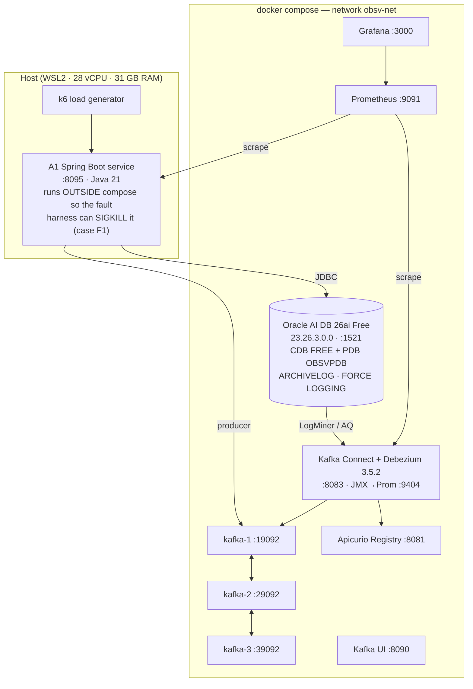

# Implementation Environment
## Chapter 5 source material — the experiment stack, how it is built, and what it cost to get right

**Status: operational.** All nine services run; Debezium 3.5.2.Final is loaded with the Oracle
connector; the Oracle schema is migrated; the ground-truth and AQ capture paths are verified
end to end.

---

## 1. Topology



Kafka runs as three brokers in KRaft mode with `RF=3`, `min.insync.replicas=2` and
`unclean.leader.election.enable=false`. Three brokers are not incidental: they are required for
fault case F2 (broker-majority loss) to be meaningful, and they make the durability settings under
test the same ones a bank would run.

**Port note.** Prometheus is published on 9091 and the application on 8095, because the host
already runs an unrelated `bn-*` stack occupying 9090 and 8080. Nothing in that stack is touched.

## 2. Files

| Path | Purpose |
|---|---|
| `docker/docker-compose.yml` | The nine-service stack |
| `docker/connect/Dockerfile` | Debezium Connect plus the JMX→Prometheus agent (pinned 1.0.1) |
| `docker/connect/connect-jmx.yml` | JMX scrape rules for `debezium.oracle` and `kafka.connect` MBeans |
| `docker/oracle/init/01_cdb_logging.sql` | ARCHIVELOG, FORCE LOGGING, supplemental logging, OMF destination |
| `docker/oracle/init/02_capture_user.sql` | `c##dbzuser` and its 17 grants; per-container tablespaces |
| `docker/oracle/init/03_pdb_schema.sql` | `OBSV` schema owner and privileges |
| `docker/prometheus/prometheus.yml` | Scrape configuration |
| `scripts/stack-up.sh` | One command: bring up, wait healthy, prepare Oracle, print endpoints |
| `scripts/setup-oracle.sh` | Idempotent Oracle preparation; skips the restart when already prepared |
| `scripts/stack-down.sh` | Stop; `--volumes` also wipes state for a clean run |
| `src/main/resources/db/migration/V1..V8` | Flyway schema: core A1, ground truth, outbox, AQ, PL/SQL events, synthetic-data model and generator, AQ event-id parity |
| `src/main/java/.../aq/AqJmsConfiguration.java` | Approach 1: unpooled Oracle DataSource and AQ-JMS connection factory, created only in `AQ` mode |
| `src/main/java/.../aq/AqToKafkaBridge.java` | Approach 1: batched transacted drain of the durable subscriber onto Kafka |
| `src/main/java/.../harness/EnvironmentAssertions.java` | Refuses to start a run whose apparatus is broken (see finding 20) |
| `src/main/java/.../harness/ModeActivator.java` | Capture triggers and per-mode ALL-column supplemental logging |
| `docker/connect/connectors/*.json.tmpl` | Debezium connector definitions for `CDC` and `HYBRID` |
| `scripts/register-connector.sh` | Registers a connector and blocks until it is provably streaming |

## 3. Schema

| Object | Migration | Role |
|---|---|---|
| `TXN_A1`, `LEDGER_ENTRY` | V1 | The A1 state machine under test, identical in every mode |
| `SEQ_A1_EVENT` | V1 | `NOORDER` sequence — avoids the RAC sequence-ordering latch |
| `GROUND_TRUTH`, `TRG_GROUND_TRUTH` | V2 | **The control instrument** (§4) |
| `TXN_A1_EVT_SEQ`, `NEXT_EVT_SEQ` | V2 | Per-aggregate monotonic counter for gap and ordering detection |
| `DBZ_HEARTBEAT` | V2 | Debezium heartbeat target; prevents the offset stall that precedes fault F4 |
| `A1_EVENT_OUTBOX`, `EMIT_A1_EVENT` | V3 | Outbox for Approach 2-B3 and the hybrid; shared Java/PL-SQL publication contract |
| `A1_EVT_QT`, `A1_EVT_Q` | V4 | Advanced Queuing objects for Approach 1 |
| `PKG_A1_EVENT`, `TRG_TXN_A1_AQ` | V5 | Event factory and capture trigger for Approach 1 |

Both triggers are created **disabled**. The harness enables exactly the capture mechanism the
current mode requires, so modes can never overlap within a run.

## 4. The control instrument and its own overhead

`GROUND_TRUTH` records every committed A1 state transition, written by a compound trigger in the
same transaction as the business change. A trigger is the only mechanism that captures *all*
writers, which is what the reference must do to stay independent of the application-level
pipelines under test.

That independence costs constant overhead on every instrumented run. Rather than hide it, the
design measures three baselines:

| Mode | Ground truth | Pipeline | Measures |
|---|---|---|---|
| `OFF` | off | none | True zero-instrumentation throughput |
| `BASELINE_GT` | on | none | **The cost of the measuring apparatus itself** |
| `<mode>` | on | that mode | Apparatus + mechanism |

Reported cost of a mode is `<mode> − BASELINE_GT`; the apparatus cost `BASELINE_GT − OFF` is
reported separately as a result in its own right. This turns a methodological weakness into a
quantified, defensible statement — a point worth making explicitly at the defence.

## 5. Verified end to end

| Check | Result |
|---|---|
| ARCHIVELOG, FORCE LOGGING, supplemental logging (min) | enabled; `archive_dest_status = VALID` |
| Capture user `C##DBZUSER` with `LOGMINING` | created, verified by an assertion that raises rather than reporting false success |
| LogMiner reads A1 transitions with before-images | verified (see `evidence/R1-logminer-feasibility.md`) |
| Flyway V1–V5 | applied; **zero invalid objects** |
| Ground-truth capture | 3 transitions recorded with commit SCNs `2314433 / 2314475 / 2314480` |
| Approach 1 (trigger → `DBMS_AQ` → queue table) | 2 messages enqueued, correctly typed `A1TransactionInitiated`, `A1TransactionValidated` |
| Debezium Oracle connector plugin | `OracleConnector 3.5.2.Final` loaded |
| Prometheus scraping | `connect` up, `prometheus` up, `a1-app` down (application not yet started) |
| Setup idempotency | second run skips the restart and reports objects as present |


## 5a. The application under test

`itpu.uz.masterthesisobservability`, Spring Boot 4.1.1 on Java 21, running on the **host** (not in
compose) so the fault harness can `SIGKILL` and restart the JVM directly for fault case F1.

| Package | Contents |
|---|---|
| `config` | `ObservabilityMode` (the eight-mode experiment switch), `ObservabilityProperties`, `TransactionalEventingConfiguration` (transaction advisor ordered 100), `EventEmitterConfiguration` (selects one strategy per run) |
| `domain` | `TxnA1` aggregate with an explicit state machine, `LedgerEntry`, repositories with `findByTxnRefForUpdate` |
| `service` | `A1TransactionService` — **identical in every mode**; only the emitter behind `@EmitsEvent` changes |
| `api` | REST endpoints per transition, per-transition Micrometer timer tagged with the active mode |
| `outbox` | `@EmitsEvent`, `EventEmittingAspect` (ordered 200, inside the transaction), `OutboxWriter` (`MANDATORY` propagation), `OutboxRelay` (`FOR UPDATE SKIP LOCKED`) |
| `naive` | `DirectKafkaEventEmitter` (B1) and `AfterCommitEventEmitter` (B2) — the refuted baselines, implemented faithfully so they can be measured rather than merely asserted to be wrong |
| `harness` | `ModeActivator` — enables exactly the capture triggers the active mode requires, at startup |
| `metrics` | `OracleMetricsBinder` (outbox backlog, AQ depth, exception-queue depth, ground-truth count, redo size, current SCN), `TraceContext` |

**One emitter interface, four strategies.** Every mode traverses an identical joinpoint and an
identical business code path; only the emission differs. That is what makes the throughput and
latency deltas attributable to the mechanism rather than to incidental differences in how each
variant happened to be wired — an internal-validity property worth stating explicitly.

### Verified end to end (mode `WRAPPER_B3`)

| Check | Result |
|---|---|
| `POST /api/a1` | 201, status `INITIATED` |
| `POST /api/a1/{ref}/validate` | 200, status `VALIDATED` |
| `POST /api/a1/{ref}/process` | 200, status `PROCESSED` |
| Invalid transition (process twice) | **409** — the state machine rejects it |
| Unknown reference | **404** |
| `GROUND_TRUTH` | 3 transitions recorded for the transaction, sequence 1-2-3 |
| `A1_EVENT_OUTBOX` | 5 rows, all `PUBLISHED` by the relay |
| Kafka `bank.a1.transaction.events` | all 5 events delivered, correctly typed, per-aggregate order preserved |
| Prometheus | `obsv_outbox_pending`, `obsv_ground_truth_transitions`, `obsv_oracle_redo_size_bytes`, `obsv_aq_exception_queue`, `a1_transition_seconds{mode=...}` all exposed |

## 6. Environment findings

Twenty-three deviations from the documented happy path were encountered. Each is reproducible, each has
an identified cause, and each is worth a line in Chapter 5 — collectively they are the difference
between a design that is described and one that has actually been built. Six failed **silently**,
which is the more important observation.

| # | Symptom | Cause | Resolution | Silent? |
|---|---|---|---|---|
| 1 | `ORA-02236: invalid file name` on `CREATE TABLESPACE ... DATAFILE SIZE 100M` | `DB_CREATE_FILE_DEST` unset, so Oracle-Managed-Files syntax is unavailable | Set `DB_CREATE_FILE_DEST` before any tablespace DDL | No |
| 2 | `ORA-65048` / `ORA-00959` naming a PDB while creating the common user | A `CONTAINER=ALL` user's default tablespace must exist in **every** container, not only `CDB$ROOT` | Create `logminer_tbs` in `CDB$ROOT` and in each PDB first. **Applies equally to a production bank CDB.** | No |
| 3 | Capture user absent although the script reported success | **`ALTER SESSION SET CONTAINER` cannot be executed from PL/SQL.** Under `WHENEVER SQLERROR CONTINUE` the failure was invisible | Switch containers at SQL\*Plus level only; add an assertion that raises `ORA-20001` if the user is missing | **Yes** |
| 4 | `SP2-0042: unknown command "&tbs_block"` | SQL\*Plus `DEFINE` substitution variables are limited to ~240 characters; a multi-line PL/SQL block silently exceeds it | Write the block out explicitly per container | **Yes** |
| 5 | `ORA-03405`, and later statements never executed | A trailing `-- comment` on the **same line** as the `;` terminator; and a line ending in `-` is a SQL\*Plus **continuation** character, so `PROMPT ---text---` swallows the next line | Comments on their own lines; never end a line with a hyphen | **Yes** |
| 6 | `DBMS_OUTPUT` from later containers missing | `ALTER SESSION SET CONTAINER` resets session state, including `SERVEROUTPUT` | Re-issue `SET SERVEROUTPUT ON` after every container switch | **Yes** |
| 7 | `docker exec -i` hangs forever | An open stdin makes SQL\*Plus block waiting for input when a statement errors under `WHENEVER SQLERROR CONTINUE` | Drop `-i`; redirect `</dev/null` | No |
| 8 | `PLS-00684: invalid data type for the JSON return value` | `JSON_OBJECT(... RETURNING CLOB)` cannot be used as a PL/SQL expression on this release — verified against three variants, only `SELECT ... INTO ... FROM dual` compiles | Evaluate in SQL context | No |
| 9 | `PLS-00678: RETURN statement not allowed inside Compound Triggers` | Guard clauses are illegal in compound trigger sections | Express early exit as a guarding `IF` | No |
| 10 | `PLS-00231: function 'PCT' may not be used in SQL` | A package-body-private function cannot be called from inside a SQL statement | Evaluate in PL/SQL, bind the value into the SQL | No |
| 11 | `PLS-00103: Encountered the symbol "TYPE"` | In a package **body**, all `TYPE` declarations must precede every subprogram body | Move type declarations to the top of the body | No |
| 12 | `package com.fasterxml.jackson.databind does not exist` | **Spring Boot 4 ships Jackson 3**: group `tools.jackson.core`, package `tools.jackson.databind`, and serialization exceptions are now **unchecked** | Update imports; remove the now-dead `catch (JsonProcessingException)` | No |
| 13 | `spring-boot-starter-aop` unresolvable | Renamed to **`spring-boot-starter-aspectj`** in Boot 4 | Use the new artifact id | No |
| 14 | Jackson and Bean Validation absent at compile time | Boot 4's `spring-boot-starter-webmvc` no longer brings them transitively | Add `spring-boot-starter-jackson` and `spring-boot-starter-validation` explicitly | No |
| 15 | `org.testcontainers:oracle-free` version unresolvable | **Testcontainers 2.0 renamed every module** with a `testcontainers-` prefix | `testcontainers-oracle-free`, `testcontainers-kafka`, `testcontainers-junit-jupiter` | No |
| 16 | Schema validation: `wrong column type ... found [char], expecting [varchar2]` | `CHAR(n)` columns versus Hibernate's `VARCHAR2` expectation. `ddl-auto: validate` caught it at startup | Changed the DDL to `VARCHAR2` — `CHAR` blank-padding is a latent source of comparison bugs regardless | No |
| 17 | **`ORA-18716: not in any time zone`** on every read of an entity with an `Instant` field | Hibernate maps `Instant` to the `TIMESTAMP_UTC` JDBC type, which on Oracle is `TIMESTAMP WITH TIME ZONE`; the column is plain `TIMESTAMP(6)`. `hibernate.timezone.default_storage=NORMALIZE_UTC` does **not** fix it, because that setting governs `OffsetDateTime`/`ZonedDateTime`, not `Instant` | Annotate the fields `@JdbcTypeCode(SqlTypes.TIMESTAMP)` and set `hibernate.jdbc.time_zone=UTC`. Keeps `Instant` in the domain — the right type for an event timestamp — while matching the physical column | No |
| 18 | `Tracer` bean not found at startup | `micrometer-tracing-bridge-otel` alone does not produce a `Tracer`; an OpenTelemetry SDK and exporter are also required | Access the tracer through `ObjectProvider` so an absent tracing backend degrades to a null trace id instead of preventing the experiment from running | No |
| 19 | `AQjmsException: Error creating the db_connection`, caused by `ClassCastException: HikariProxyConnection cannot be cast to oracle.jdbc.internal.OracleConnection` | AQ JMS casts the JDBC connection it is given to Oracle's internal interface to reach the AQ protocol layer. HikariCP hands out a **dynamic proxy**, so the cast fails | Give the AQ connection factory an unpooled `oracle.jdbc.datasource.impl.OracleDataSource`. Any pool that wraps rather than delegates is unusable here — a real integration constraint of Approach 1 | No |
| 20 | **56% of HTTP requests failing with `ORA-12516`, looking exactly like an Approach 1 performance catastrophe** | Fixing finding 19 by declaring `@Bean DataSource aqDataSource` made Spring Boot's `DataSourceAutoConfiguration` back off, because it is guarded by `@ConditionalOnMissingBean(DataSource.class)`. **The whole application then ran with no connection pool**: a new physical Oracle connection per JDBC call, `processes` peaking at 198 of 200 | Construct the AQ DataSource privately inside the `ConnectionFactory` bean method so it never enters the context. `EnvironmentAssertions` now refuses to start a run unless the OLTP DataSource is a `HikariDataSource` of the expected size | **Yes** |
| 21 | Debezium task FAILED with `ORA-41900: missing LOCK privilege on "OBSV"."TXN_A1"` | **Oracle 23ai separated the LOCK privilege from SELECT.** The capture user held `SELECT ANY TABLE`, which used to imply the table lock the connector takes for its schema snapshot. There is no `GRANT LOCK ON <table>` object privilege — `ORA-00990` — so the only grant-based fix is the system-wide `LOCK ANY TABLE` | Set `snapshot.locking.mode=none` on the connector, which removes the requirement entirely and costs nothing with `snapshot.mode=no_data`. Every Debezium-on-Oracle privilege list written before 23ai is incomplete on this point, and `LOCK ANY TABLE` on a capture account is not something a bank will grant | No |
| 22 | Task FAILED with `Failed to create flush table`, caused by `ORA-01031` | Debezium's LogMiner strategy creates a `LOG_MINING_FLUSH` table **in the capture user's own schema** and writes to it to force LGWR to flush. The capture user had no `CREATE TABLE`. The connector snapshots successfully and reports RUNNING before dying on its first streaming iteration, so the missing privilege does not surface until the phase where it is used | `GRANT CREATE TABLE TO c##dbzuser CONTAINER=ALL` plus a tablespace quota | No |
| 23 | The quota granted by `CREATE USER ... QUOTA UNLIMITED ON logminer_tbs CONTAINER=ALL` was absent inside the PDBs | The `QUOTA` clause does **not** propagate to each container; only the `CDB$ROOT` quota is established. `DBA_TS_QUOTAS` in `OBSVPDB` held no row for the user despite the `CONTAINER=ALL` creation | Issue `ALTER USER ... QUOTA UNLIMITED ON logminer_tbs` explicitly in every container. Same class as finding 2: a container-scoped clause that reads as global and is not | **Yes** |

**Finding 8 is not merely a syntax workaround — it is a measurable cost attributable to Approach 1.**
Because payload construction must be evaluated in SQL context, every emitted event incurs a
mandatory PL/SQL-to-SQL context switch on the OLTP critical path. Approaches 2 and 3 build their
payloads in the JVM and outside the transaction respectively, and pay nothing equivalent. This
belongs in the performance analysis, not in a footnote.

Findings 3, 4, 5 and 6 share a single root cause worth stating as a lesson: **`WHENEVER SQLERROR
CONTINUE` combined with a `PROMPT`-based success message produces scripts that report success
while having done nothing.** Every setup script in this repository now ends with an assertion
block that raises an application error if the objects it was supposed to create are absent.

**Finding 20 is the most dangerous defect encountered in this work, and it is worth Chapter 5's
closing paragraph.** It did not crash, did not warn, and did not appear in the health endpoint.
The application started, reported healthy, served traffic, and produced a complete, plausible,
internally consistent set of measurements. Those measurements said that Advanced Queuing
collapses under load: 56% of requests failing, HTTP p99 of 19.6 s, and only 1 446 of an expected
9 000 state transitions completing. Every one of those numbers was real, and every one of them
was caused by the connection pool having silently disappeared — not by Advanced Queuing, which
on a correctly pooled run completed all 9 003 transitions with zero request failures and an HTTP
p95 of 8.5 ms.

The lesson generalises beyond this experiment: **a benchmark that cannot detect its own broken
apparatus does not measure the system under test, it measures the breakage** — and it reports
the result under the system's name. This is precisely the failure mode that makes published
performance comparisons between event-generation approaches untrustworthy, and it is the reason
this thesis reports a three-baseline design (`OFF` / `BASELINE_GT` / mode) and asserts its
environment at startup rather than assuming it.

## 7. Toolchain versions

| Component | Version | Note |
|---|---|---|
| Oracle | AI Database 26ai Free 23.26.3.0.0 | Image tag says `23`; the release is 26ai |
| Debezium | 3.5.2.Final | Supports Oracle through 26ai — no version gap |
| Kafka | Apache 4.1.0, KRaft | 3 brokers, RF=3 |
| Spring Boot | 4.1.1 | Java 21 |
| Flyway | 12.4.0 | `flyway-database-oracle` needs an explicit version in *plugin* dependencies |
| Testcontainers | 2.0.5 | **All modules renamed with a `testcontainers-` prefix** (`testcontainers-oracle-free`, not `oracle-free`) |
| Apicurio Registry | 2.6.2.Final | Apache-2.0; chosen so the thesis artefact is redistributable |
| JMX Prometheus agent | 1.0.1 | 1.1.0 does not exist on Maven Central |

**The cost of a very recent stack.** Findings 12-15 are all consequences of building on Spring
Boot 4 and Testcontainers 2.0 within months of their release: Jackson 2 to Jackson 3, the AOP
starter rename, starters no longer bringing Jackson and validation transitively, and every
Testcontainers module renamed. None is difficult once identified, but collectively they are
several hours that a thesis plan should budget for. The compensating benefit is that the results
are measured on current software rather than on a stack that will be two major versions old by
the defence.

**Finding 17 is the one to remember.** `ORA-18716` appears on every read, not on write, so the
application inserts happily and then fails on the first `SELECT` — and the obvious remedy
(`NORMALIZE_UTC`) does not work, because it governs a different set of types than the one
actually involved.

## 8. Running it

```bash
./scripts/stack-up.sh          # up, wait healthy, prepare Oracle, print endpoints
./mvnw flyway:migrate          # apply V1..V5
./scripts/stack-down.sh        # stop, keep data
./scripts/stack-down.sh --volumes   # stop and wipe, for a clean experiment run
```

| Endpoint | URL |
|---|---|
| Oracle | `localhost:1521/OBSVPDB` — `obsv` / `Obsv_2026` |
| Kafka | `localhost:19092,29092,39092` |
| Kafka Connect | http://localhost:8083 |
| Connect metrics | http://localhost:9404/metrics |
| Schema Registry | http://localhost:8081 |
| Prometheus | http://localhost:9091 |
| Grafana | http://localhost:3000 |
| Kafka UI | http://localhost:8090 |
