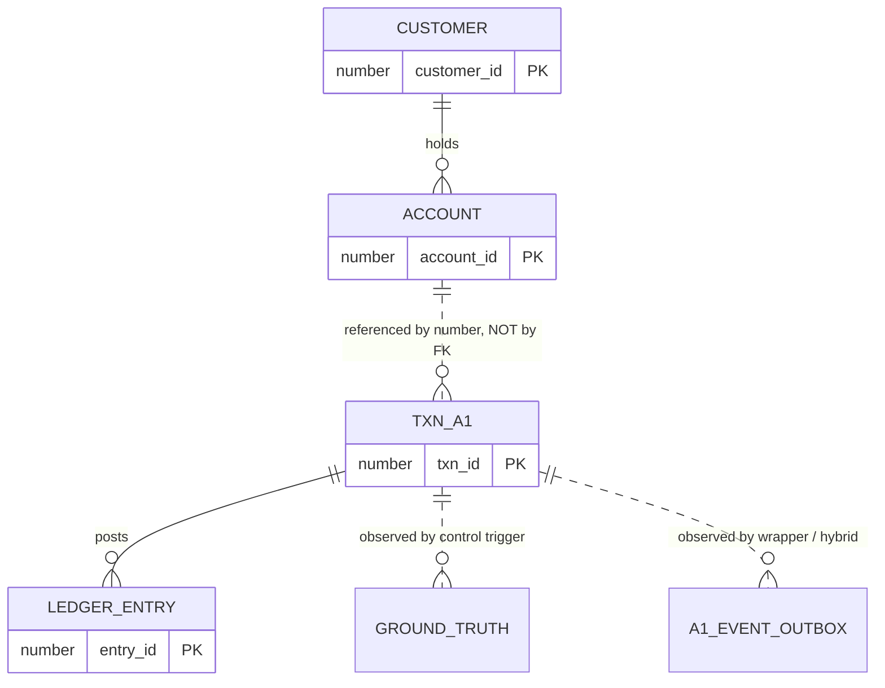

# The Synthetic Dataset
## Chapter 5 source material — data model, generation parameters, and why no production data is used

---

## 1. Decision: no production banking data

The experiments run entirely on generated data. Production or production-derived records from the
bank's test environment are used for **nothing** — not for seeding, not for calibration, not for
illustration in the thesis.

The decision is made on information-security grounds. It also improves the work:

| | Effect |
|---|---|
| **Reproducibility** | The generator and its parameters ship with the thesis. Any reader can regenerate the exact dataset and re-run the experiments. An experiment run on production data could never be independently verified — a serious weakness for an empirical thesis. |
| **Control** | Transaction rate, currency mix, channel mix and amount distribution must be held constant across the six modes for the comparison to be internally valid. Replaying production traffic at a controlled, repeatable rate is not practical. |
| **Destructive testing** | The fault matrix requires purging archive logs, killing instances, and deliberately breaking a trigger to observe the resulting payment failures. None of this is permissible against a shared database holding real customer records. |
| **Publishability** | Sample payloads, schema listings and result tables can be printed in the thesis and defended in an open viva without redaction. |

**No personal data of any kind is generated.** Customers carry a reference, a segment, a branch
code and a risk rating. There are no names, addresses, dates of birth or identity numbers.
Personal attributes play no part in the A1 state machine being measured, so omitting them removes
all re-identification risk at zero cost to the experiment's validity. This is worth stating
explicitly in the thesis: it is a design choice, not an omission.

**Answering the inevitable examiner question — "isn't synthetic data a threat to validity?"**
Yes, and it is declared as one in the threats-to-validity section. But the threat is bounded and
specific: it affects the *absolute* realism of the workload, not the *relative* comparison between
modes, which is what every claim in this thesis rests on. All six modes process an identical
workload; whatever is unrealistic about that workload is unrealistic for all of them equally.

---

## 2. Data model



`TXN_A1` deliberately carries account **numbers**, not foreign keys to `ACCOUNT`. Two reasons, both
worth a sentence in the thesis:

1. **Realism** — in a payment system the counterparty account frequently belongs to another
   institution and cannot be a foreign key.
2. **Measurement fidelity** — a foreign key on `TXN_A1` would add constraint validation to every
   insert, changing the DML cost that the whole experiment sets out to measure and confounding
   the comparison between modes.

### Synthetic account numbering

A 20-digit domestic scheme, structurally similar to a real Uzbek account number, with entirely
fabricated values:

```
20208 860 0000 00000328
└─┬─┘ └┬┘ └─┬┘ └───┬──┘
  │    │    │      └── account serial
  │    │    └───────── synthetic branch code
  │    └────────────── ISO 4217 numeric currency (860 UZS, 840 USD, 978 EUR, 643 RUB)
  └─────────────────── balance account code (20208 demand deposit, 20206 settlement)
```

**Naming note:** the columns are `DEBIT_ACCOUNT` / `CREDIT_ACCOUNT`, not `IBAN`. Uzbekistan is not
in the IBAN registry; domestic accounts are 20-digit numbers. The columns are sized `VARCHAR2(34)`
so a genuine IBAN also fits, which is what a cross-border ISO 20022 leg would carry.

---

## 3. Generation parameters

These are **assumptions** — plausible retail-banking values, not measurements. They are recorded
in the `SYNTH_CONFIG` table with every generation run and must be reported as assumptions in the
thesis. They are the single largest external-validity limitation of the dataset.

| Parameter | Value | Note |
|---|---|---|
| Customers | 50 000 | Default; configurable |
| Accounts | 84 035 | Retail 1–2 accounts, business 2–4 |
| Segment mix | RETAIL 88 %, SME 10 %, CORPORATE 2 % | |
| Currency mix | UZS 85 %, USD 10 %, EUR 4 %, RUB 1 % | Applies to *additional* accounts; every customer's **first** account is always UZS, so the realised account mix is ~94 % UZS |
| Channel mix | MOBILE 55 %, WEB 25 %, ATM 10 %, BRANCH 7 %, API 3 % | |
| Terminal outcome | PROCESSED 96 %, REJECTED 4 % | |
| Amount | log-normal, `EXP(μ + σ·N(0,1))` UZS | RETAIL μ=13.1 σ=1.9 · SME μ=15.4 σ=1.6 · CORPORATE μ=17.2 σ=1.4 |
| Account status | ACTIVE 98 %, BLOCKED 1.5 %, CLOSED 0.5 % | Blocked and closed accounts are excluded from the transaction pool |
| Random seed | 20260902 | Deterministic |

**Calibration path, if it is ever wanted.** Only aggregate statistics would be needed — row counts,
status distribution, amount percentiles, intraday volume curve, column widths. None of those are
personal data or account-identifying. Recalibration then requires changing `SYNTH_CONFIG`
parameters alone; no code changes. This is offered as an option, not a dependency: the thesis
stands on the declared assumptions as they are.

---

## 4. Verification — realised distributions

Measured on a 1 000-transaction sample, confirming the generator reproduces its target parameters:

| Property | Target | Realised | |
|---|---|---|---|
| PROCESSED | 96 % | 95.9 % | ✓ |
| REJECTED | 4 % | 4.1 % | ✓ |
| MOBILE | 55 % | 52.8 % | ✓ |
| WEB | 25 % | 25.7 % | ✓ |
| ATM | 10 % | 11.5 % | ✓ |
| BRANCH | 7 % | 7.7 % | ✓ |
| API | 3 % | 2.4 % | ✓ |
| Ledger rows per PROCESSED txn | 2 | 1 904 / 952 = 2.00 | ✓ |

UZS amount distribution — the log-normal right skew a real payment mix exhibits:

| min | median | p95 | p99 | max |
|---|---|---|---|---|
| 2 150 | 654 498 | 18 663 125 | 76 301 383 | 290 642 645 |

**Determinism verified:** two independent runs with seed `20260902` both produced exactly 50 000
customers and **84 035** accounts. Same seed, same dataset.

---

## 5. Throughput

| Operation | Volume | Time | Rate |
|---|---|---|---|
| Reference generation | 50 000 customers / 84 035 accounts | 5.75 s | ~14 600 accounts/s |
| Transaction generation, full lifecycle | 20 000 txns (3 state transitions + 2 ledger rows each) | 3.26 s | **~6 100 txn/s** |

At that rate the 500 000-row batch of workload profile P4 takes roughly 80 seconds, which is
comfortably inside a fault-injection window.

**Performance note worth recording in Chapter 5.** The first implementation selected a random
counterparty with `ORDER BY DBMS_RANDOM.VALUE`, which sorts the entire `ACCOUNT` table on *every*
call and makes batch generation quadratic. Replacing it with an account pool bulk-collected into
PGA once per invocation is what makes P4 feasible at all.

---

## 6. The batch generator is also an experimental instrument

`PKG_SYNTH_DATA.generate_transactions` writes A1 transactions **directly in PL/SQL, bypassing the
Spring application entirely.** That is not a convenience — it is the concrete embodiment of
assumption **[A-3]** (not all writers go through the application) and it is what makes two of the
thesis's most important experiments possible:

* **Fault F11** — the wrapper approach produces *zero* events for this workload, while CDC and the
  trigger-based approach capture all of it. The blind spot becomes a measured number rather than
  an argument.
* **Fault F5** — calling with `p_commit_every => 0` leaves the whole batch in a single open
  transaction, which is exactly how a transaction outstanding longer than Debezium's
  `log.mining.transaction.retention.ms` is produced, and therefore how the silent CDC loss mode is
  demonstrated.

---

## 7. Usage

```bash
./scripts/seed-data.sh                              # 50 000 customers, no workload
./scripts/seed-data.sh --customers 10000            # smaller reference population
./scripts/seed-data.sh --transactions 500000        # P4 batch profile
./scripts/seed-data.sh --reset                      # clear workload, KEEP reference data
./scripts/seed-data.sh --purge --customers 50000    # clear everything and regenerate
./scripts/seed-data.sh --seed 12345                 # a different deterministic dataset
```

`--reset` is the one used between experiment runs: it clears `TXN_A1`, `LEDGER_ENTRY`,
`GROUND_TRUTH`, `A1_EVENT_OUTBOX` and the sequence table while preserving the account population,
so every run starts from an identical reference state without paying regeneration cost.

---

## 8. Limitations to declare

* Distribution parameters are assumed, not measured. **This is the dataset's principal threat to
  external validity** and belongs in the threats-to-validity section, not in a footnote.
* No intraday arrival curve is modelled in the data itself; arrival shaping is the load
  generator's job (workload profiles P1–P5).
* No customer behavioural correlation: counterparties are drawn independently, so there are no
  recurring payer/payee relationships. Real payment graphs are heavily clustered. This affects
  buffer-cache hit ratios and index locality, and therefore absolute performance numbers — but
  again, identically for all six modes.
* Balances are generated but not maintained transactionally; `LEDGER_ENTRY` records postings
  without updating `ACCOUNT.BALANCE`. The experiment measures event generation, not ledger
  correctness, and adding balance maintenance would add contention that is not part of the object
  of study. Declare this explicitly rather than letting an examiner find it.
